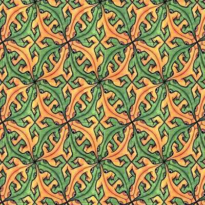

**Alttaki `Markdown` biçemli dokümanda birçok düzensiz deyim, yanlış biçem etiketleri, de bunun gibi sorunlar vardır çünkü bu doküman `pandoc` adlı (Haskell ile yazılmış ;) bir dönüştürücü ile `TeX` biçeminden `Markdown` biçemine otomatik olarak çevrilmiş sonra üstünde hiçbir işlem, düzeltme yapılmamıştır.**

**Dokümandaki düzensizlikler bilinçli olarak düzeltilmemiştir çünkü bu arşivin amacı, `Haskell The Hard Way` belgesinin özgün (true) PDF biçeminde düzenlemektir. Dolayısıyla, bu `README` dosyasına bakmak ya da düzeltmek yerine dokümanın ekteki son PDF sürümünü indirmelisiniz.**

This is the Turkish translation of Y. Esposito's article
Learn Haskell Fast and Hard

# Giriş

\[ Bu belge, Yann Esposito'nun Learn Haskell Fast and Hard başlıklı blog
gönderisinden (*blogpost*) Türkçe'ye çevirilmiştir. Yann
Esposito`yannespositocom/about-me.html` yaprağında Fransa'da yaşadığını,
Amerika'daki Cisco firmasında Clojure programlama dili ile uzaktan
çalıştığını, hafta sonları ise Haskell ile Purescript ayrıca şunları
kullandığını belirtmektedir:\

[Yazılım araçları]{.underline}:\
macOS üzerinde "nix with home-manager", yadm\
(Eski VIM kullanıcısı ayrıca Spacemacs kullanmış biri olarak)\
Emacs üzerinde doom-emacs, org-mode, org-journal, org-roam\
magit, forge, github-review, weechat, wee-slack\

[Bilgi siteleri]{.underline}:\
Laarc `www.laarcio`\
Lobsters `lobsters`\
Discover Dev `www.discoverdevio`\
Hacker News `news.ycombinatorcom` \]

### Kendimize Bir Ünite Yapalım

TL, DR[^1] Haskell öğrenmek için kısa, yoğun bir belge.

Tüm geliştiricilerin Haskell öğrenmesi gerektiğine inanıyorum. Herkesin
süper Haskell ninjası olması gerektiğini düşünmüyorum ancak herkes
Haskell'in egemen olduğu değişik yönlerini görmeli. Haskell öğrenmek
belleğinizi açar.

Anaakım diller eş temelleri paylaşırlar:

-   değişken

-   döngü

-   gösterici (*pointer*[^2])

-   veri yapıları, nesneler ile klaslar (genellikle)

Ancak Haskell çok değişiktir. Bu dil daha önceden hiç duymamış olduğum
bir sürü kavram kullanıyor. Bu kavramların çoğu daha iyi bir programcı
olmanıza yardım edecektir.

Haskell öğrenmek zor olabilir, benim için öyleydi. Bu yazıda benim
öğrenme sürecimde eksik olan nesleri size sunmaya çalışacağım.

Bu yazıyı izlemek zor olacak bunu bilerek yapıyorum; Haskell öğrenmenin
kısayolu yoktur, zor olup çaba ister. Ancak bunun iyi bir nes olduğuna
inanıyorum; Haskell, zor olduğu için ilginç.

Haskell öğrenmenin klasik yolu şu iki belgeyi okumaktır. İlk önce Learn
You a Haskell For Greater Good[^3] (İyiliğiniz İçin Bir Haskell Öğrenin)
sonra da Real World Haskell, O'Reilly [^4] (Gerçek Yaşamda Haskell). Ben
de bunun doğru yol olduğuna inanıyorum. Haskell'i doğru düzgün öğrenmek
için bu belgeleri ayrıntılı biçimde okumalısınız.

Tersi biçimde, bu yazı Haskell'in ana konularının oldukça kısa, yoğun
bir özeti. Kendim Haskell öğrenirken gereksinim duyup bulamadığım kimi
bilgileri de ekledim.

Bu yazının beş bölümü var:

-   Giriş: Haskell'in ince yürekli olabildiğini göstermek için bir kısa
    örnek.

-   Temel Haskell: Haskell söz dizimi ile kimi temel kavramlar.

-   Zor Bölüm

    -   Fonksiyonel stil; imperatif stilden fonksiyonel stile adım adım
        ilerleyen bir örnek.

    -   Tipler; tipler ile standard bir ikili ağaç *(binary tree)*
        örneği.

    -   Sonsuz Yapılar; sonsuz bir ikili ağacı işleyin.

-   Çok Zor Bölüm

    -   IO ile baş edin; minimal bir örnek.

    -   IO çalımları *tricks* açıklaması, IO'yu anlamak için gereksinim
        duyduğum gizli detay

    -   Monad'ler, inanılmaz genellenebilirlikleri

-   Ek:

    -   Sonsuz ağaçlara ilişkin matematik temelinde bir tartışma.

Sonu `.lhs` ile biten bir dosya adını her gördüğünüzde, dosyaya ulaşmak
için üstüne tıklayabilirsiniz (PDF doküman için geçerli değil) Dosyayı
`dosyaismi.lhs` diye saklarsanız, `runhaskell dosyaadi.lhs` komutuyla
çalıştırabilirsiniz.

Kimileri çalışmayabilir ancak çoğu çalışacaktır. Aşağıda linki
görebilirsiniz[^5]

(Çevirmen notu: Kodlardaki karakter dizileri Türkçeleştirilmiş, ancak
değişken adları olduğu gibi bırakılmıştır. İndirilen kodlar İngilizce
kaynaktan olup Türkçeleştirilmemiş olacaktır.)

### Giriş {#giriux15f}

#### Kurulum için gerekli araçlar: {#kurulum}

-   `ghc`: `C`'deki gcc gibi bir derleyici.

-   `ghci`: Etkileşimli (*interaktif*) Haskell yorumlayıcısı. (REPL,
    Read Evaluate, Print Loop)

-   `runhaskell`: Bir programı derlemeden çalıştırmak için kullanılır.

#### Korkmayın {#korkmayux131n}

{width="0.4\\linewidth"}

Haskell üzerine pek çok belge/anlatı az bilinen bir formülü (quick sort,
Fibonacci, de bunun gibi) yazmakla başlar, ben bunun direkt tersini
yapacağım. İlk önce size Haskell'in süper güçlerini göstermeyeceğim.
Haskell ile öteki programlama dilleri arasındaki benzerliklerle
başlayacağım. Zorunlu "İyi Günler Eyge" programıyla başlayalım.

``` {.haskell language="Haskell"}
main = putStrLn "Iyi Gunler Eyge!"
```

Çalıştırmak için, kodu `iyigun.hs` olarak saklayıp şu komutları
kullanabilirsiniz:

``` {.shell language="shell" numbers="none" nolol=""}
~ runhaskell ./iyigun.hs
  Iyi Gunler Eyge!
```

Doğrudan kaynak kodunu da indirebilirsiniz. Aşağıdaki komutların hemen
altında linki görüp, `00_hello_world.lhs` olarak saklayıp bu komutlarla
çalıştırabilirsiniz:

``` {.shell language="shell" numbers="none" nolol=""}
~ runhaskell 00_hello_world.lhs
  Hello World!
```

Şimdi, adınızı sorup aldığı yanıtla size "Iyi Gunler" diyen bir program
yazalım:

``` {.haskell language="Haskell"}
main = do
print "Adiniz nedir?"
name <- getLine
print ("Iyi gunler, " ++ name ++ "!")
```

``` {.shell language="shell" numbers="none" nolol=""}
user>> ghc -o hello_you hello.hs
user>> ./hello_you Erkan
 Iyi günler, Erkan!
```

Öncelikle, bunu birkaç imperatif dildeki benzer programlarla
karşılaştıralım:

``` {.python language="Python"}
# Python (2?)
print "Adiniz nedir?"
name = raw_input()
print "Iyi Gunler %s!" % name
```

``` {.ruby language="Ruby"}
# Ruby
puts "Adiniz nedir?"
name = gets.chomp
puts "Iyi Gunler #{name}!"
```

``` {.[ANSI]C language="[ANSI]C" tabsize="2" escapeinside="||"}
// C
#include <stdio.h>
int main (int argc, char **argv) {
  char name[666]; // <- zorlu sayi!
  // Adim 665 karakterden çoksa ne olacak?
  printf("Adiniz nedir?\n");
  scanf("%s", name);
  printf("Iyi Gunler %s!\n", name);
  return 0;
}
```

Yapı özdeş ancak söz dizimsel değişiklikler var. Bu yazının ana kousu bu
değişikliklerin nedenini açıklamak üzerine olacak.

Haskell'de bir `main` fonksiyonu var olup her nesnenin bir tipi vardır.
`main`'in tipi `IO ()`'dur. Bu, `main` yan etkilerde bulunacak demektir.

Şimdilik, Haskell'in anaakım imperatif dillere benzer görünebileceğini
anımsamanız yeterli.

#### Haskell'e Giriş {#haskelle-giriux15f}


İlerlemeden önce, Haskell'in kimi temel özelliklerinin bilincine
varmanız gerekiyor.

###### Fonksiyonel

[]{#fonksiyonel label="fonksiyonel"}

Haskell fonksiyonel bir dildir. İmperatif bir dil geçmişiniz varsa, bir
sürü yeni nes öğrenmeniz gerekiyor. Umarım bu yeni kavramlar size
imperatif dillerde program yazarken bile yardımcı olur.

###### Akıllı Statik Tip Sistemi

[]{#akux131llux131-statik-tip-sistemi
label="akux131llux131-statik-tip-sistemi"}

Tip sistemi, `C`'de, `C++`'ta, `Java`'da olduğu gibi sizi engellemek
yerine size yardım etmek için vardır.

###### Arılık

[]{#saflux131k label="saflux131k"}

Genellikle fonksiyonlarınız dış ortamda bir nesi değiştirmeyecekler. Bu
demek oluyor ki, bir değişkenin değerini değiştiremeyecekler,
kullanıcıdan girdi alamayacaklar, ekrana yazı yazamayacaklar, yada bir
füzeyi ateşleyemeyecekler. Öte yandan, paralellik sağlamak çok kolay
olacak. Haskell kodunuzun nerede yan etkileri olduğunun, nerede arı
olduğunun ayrımını çok açık bir biçimde yapar. Ayrıca, programınız
üzerine us yürütmek de çok daha kolay olur. Çoğu yanıl, kodunuzun yalın
bölümünde engellecektir. (Most bugs will be prevented in the pure parts
of your program.) Daha da ötesi, Haskell'de saf fonksiyonlar temel bir
kural izlerler: Bir fonksiyona özdeş parametreler vermek hep özdeş
değerler döndürür.

###### Üşengeçlik

[]{#üsengeclik label="üsengeclik"}

Üşengeçlik, genelde alışılmadık bir dil tasarım seçimidir. Haskell'de
varsayılan işlem olarak her nes yalnızca gereksinim olduğunca işlenir.
Bunun sonuçlarından biri, sonsuz yapıları işlemek için çok kusursuz bir
yol sunmasıdır.

Son uyarı da Haskell kodunu hangi yöntemle okumanız gerektiği üzerine.
Benim için, bilimsel anlatıları okumak gibi. Kimi bölümleri çok açık
ancak bir formül gördünüzde odaklanarak yavaşça okuyun. Ayrıca, Haskell
öğrenirken, sıradışı söz dizimsel (*syntactical*) detayları anlamamanız
*gerçekten* önemli değil. Ancak `>>=`, `<$>`, `<-` de bunun gibi
herhangi bir değişik sembol görürseniz, görmezden gelip kodun akışını
izleyin.

##### Fonksiyon tanımı {#fonksiyon-tanux131mux131}

Şu biçimde fonksiyon tanımlamaya alışmış olabilirsiniz:

C:

``` {.[ANSI]C language="[ANSI]C" tabsize="2" escapeinside="||"}
int f(int x, int y) {
    return x*x + y*y;
  }
```

JavaScript:

``` {.Javascript language="Javascript"}
function f(x,y) {
    return x*x + y*y;
  }
```

Python:

``` {.python language="Python"}
def f(x,y):
  return x*x + y*y
```

Ruby:

``` {.ruby language="Ruby"}
def f(x,y)
    x*x + y*y
  end
```

Scheme:

``` {.Scheme language="Scheme"}
(define (f x y)
    (+ (* x x) (* y y)))
```

Son olarak, Haskell yolu da budur:

``` {.haskell language="Haskell"}
f x y = x*x + y*y
```

Yalın. Parantez yok, `def` yok.

Unutmayın, Haskell fonksiyonlar ile tipleri sıkça kullanır. Bu yüzden,
onları tanımlamak oldukça kolaydır. Söz dizimi, gereklilik nedeniyle
özellikle öyle düşünülmüştür.

##### Tip örneği {#tip-uxf6rneux11fi}

Zorunlu olmasa da, fonksiyonlar için tip bilgisi genellikle ayrıca
girilir. Zorunlu değildir, çünkü derleyici sizin için çıkarım yapacak
kadar soybağdır. Yine de tipleri yazmak iyi bir düşüncedir, çünkü kodun
anlaşılmasına yardımcı olur.

Bakalım ne yolla oluyormuş:

``` {.haskell language="Haskell"}
-- Tipleri belirtmek icin :: imini kullaniyoruz
  f :: Int -> Int -> Int
  f x y = x*x + y*y
  main = print (f 2 3)
```

``` {.shell language="shell" numbers="none" nolol=""}
~ runhaskell 20_very_basic.lhs
  13
```

Şimdi bunu deneyelim:

``` {.haskell language="Haskell"}
f :: Int -> Int -> Int
  f x y = x*x + y*y
  main = print (f 2.3 4.2)
```

Şu yanılı almış olmalısınız:

``` {.shell language="shell" numbers="none" nolol=""}
21_very_basic.lhs:6:23:
  No instance for (Fractional Int)
  arising from the literal `4.2'
  Possible fix: add an instance declaration for (Fractional Int)
  In the second argument of `f', namely `4.2'
  In the first argument of `print', namely `(f 2.3 4.2)'
  In the expression: print (f 2.3 4.2)
```

Sorun şu ki `4.2` bir tüm sayı (Int) değil. Çözümü ise: `f` fonksiyonu
için şimdilik bir tip belirtmeyerek, tip çıkarımını Haskell'e bırakmak.

``` {.haskell language="Haskell"}
f x y = x*x + y*y
  main = print (f 2.3 4.2)
```

Çalışıyor! Ne şanslıyız ki, her tip için yeni bir fonksiyon tanımlamak
zorunda değiliz. Örneğin `C`'de, `int` için, `float` için, `long` için,
`double` için de bunun gibi ayrı ayrı fonksiyon tanımlamak zorundayız.

Peki hangi tipi belirtmeliydik? Haskell'in bizim için bulduğu tipi
görmek için `ghci`'yi başlatın:

``` {.shell language="shell" numbers="none" nolol=""}
GHCi, version 7.0.4: http://www.haskell.org/ghc/  :? for help
  Loading package ghc-prim ... linking ... done.
  Loading package integer-gmp ... linking ... done.
  Loading package base ... linking ... done.
  Loading package ffi-1.0 ... linking ... done.
  Prelude> let f x y = x*x + y*y
  Prelude> :type f
  f :: Num a => a -> a -> a
```

Ne? Bu değişik tip de neyin nesi?

``` {.haskell language="Haskell"}
Num a => a -> a -> a
```

İlk önce, sağdaki `a -> a -> a` bölgesine bakalım. Anlamak için adım
adım ilerleyerek şu örnekleri inceleyelim:

  Yazılı Tip      Anlamı
  --------------- --------------------------------------------------------------------------
  Int             Int tipi
  Int -\> Int     Int'ten Int'e olan fonksiyon tipi
  Float -\> Int   Float'tan Int'e olan fonksiyon tipi
  a -\> Int       herhangi bir tipten Int'e olan fonksiyon tipi
  a -\> a         herhangi bir a tipinden özdeş a tipine olan fonksiyon tipi
  a -\> a -\> a   herhangi bir a tipinden iki argümanın özdeş a tipine olan fonksiyon tipi

`a -> a -> a` 'da `a` imine tip değişkeni diyoruz. *(type variable)*. Bu
`f`'nin iki argümanı olduğu, girilen argümanlar ile fonksiyon sonucunun
özdeş tipten olduğu anlamına geliyor. Tip değişkeni `a`, başka bir sürü
değer alabilir. Örneğin `Int`, `Integer`, `Float`...

Dolayısıyla `C` 'deki gibi zorunlu olarak bir fonksiyon için `int`,
`long`, `float`, `double` de bunun gibi tip belirtmek yerine, herhangi
bir dinamik tip tabanlı dilde olduğu gibi yalnızca bir fonksiyon
tanımlıyoruz.

Buna kimileyin parametrik çokbiçimlilik *(parametric polymorphism)* de
deniyor. Yaşamda her istediğinizin olması gibi bir nes.

Genellikle `a` herhangi bir tip olabilir, örneğin `String` yada `Int`,
ancak `Trees` gibi daha karışık tipler, başka fonksiyonlar da olabilir.
Ancak buradaki tipimiz `Num a =>` ile başlıyor.

`Num` bir tip klası. *(type class)*. Tip klasları tip grupları gibi
düşünülebilir. `Num` klası yalnızca sayı gibi davranan tipleri içerir.
Daha doğrusu, `Num`, belli bir fonksiyon listesinin, özellikle `(+)` ve
`(*)` fonksiyonlarının, etki ettiği klastır.

Tip sınıfları güçlü bir dil yapısıdır. Onlarla inanılmaz güçlü nesler
yapabiliriz. Buna daha sonra yine değineceğiz.

Sonuç olarak, `Num a => a -> a -> a` şu demek oluyor:

Diyelim ki `a`, `Num` tip klasına ait bir tip. Bu da `a` tipinden
`a -> a` tipine bir fonksiyon.

Evet, beklenenden değişik. Esasında Haskell'de hiçbir fonksiyonun
gerçekten iki argümanı yoktur. Onun yerine, her fonksiyonun yalnızca bir
argümanı vardır. Ancak anımsamalıyız ki iki argüman almakla, bir argüman
alıp ikinci argümanı bir parametre olarak alan bir fonksiyon döndürmek
denk şeylerdir.

Daha açık olmak gerekirse, `f 3 4`, `(f 3) 4`'e denktir. `f 3`'un de bir
fonksiyon olduğunu gözlemleyin:

``` {.haskell language="Haskell"}
f :: Num a => a -> a -> a

  g :: Num a => a -> a
  g = f 3

  g y ⇔ 3*3 + y*y
```

Fonksiyonlar için bir notasyon daha var. Lambda notasyonu adsız
fonksiyonlar yaratmamıza olanak sağlar. Bunlara anonim fonksiyonlar
diyoruz. Özdeş nesi lambda notasyonu (gösterimi) ile şöyle de
yazabilirdik:

``` {.haskell language="Haskell"}
g = \y -> 3*3 + y*y
```

Burada \\ kullanılıyor, çünkü λ (lambda) imine benzemekte olup ayrıca
ASCII dizisinin içindedir.

Fonksiyonel programlamaya alışık değilseniz beyniniz yanmaya başlamış
olmalı. Artık gerçek bir uygulama yazma anı.

Ancak ondan önce, tip sisteminin beklediğimiz gibi çalıştığını
doğrulayalım:

``` {.haskell language="Haskell"}
f :: Num a => a -> a -> a
  f x y = x*x + y*y

  main = print (f 3 2.4)
```

Çalışıyor, çünkü `3` hem `Float` gibi rasyonel *(Fractional)* sayılar
için, hem de `Integer` (tüm sayı tipi) için geçerli bir gösterim. `2.4`
rasyonel bir sayı olduğu için `3` de rasyonel bir sayı olarak
yorumlanıyor.

Fonksiyonumuzu birbirinden değişik tiplerle çalışmaya zorlarsak, yanıl
verecektir:

``` {.haskell language="Haskell"}
f :: Num a => a -> a -> a
  f x y = x*x + y*y

  x :: Int
  x = 3
  y :: Float
  y = 2.4
  main = print (f x y) -- calismayacak, cunku tip x ≠ tip y
```

Derleyici yanıl veriyor. İki parametre de özdeş tipten olmak zorunda.

Bunun kötü bir düşünce olduğunu, derleyicinin sizin için bir tipten
ötekine dönüşümü yapması gerektiğini düşünüyorsanız, WAT[^6] adlı
korkunç ayrıca komik videoyu kesinlikle izlemelisiniz:

### Temel Haskell

{width="0.6\\linewidth"}

Bu bölüme yalnızca göz gezdirmenizi öneriyorum. Her an yararlanacağınız
bir kaynak gibi düşünün. Haskell'in birçok özelliği vardır. Burada da
pek çoğu eksik. Notasyon alışılmadık gelirse yine buraya dönün.

İki deyimin denk olduğunu belirtmek için $\Leftrightarrow$ imini
kullanıyorum. Bu yapma notasyon: $\Leftrightarrow$ Haskell'de yoktur.
Özdeş biçimde, bir deyimin kalküle edilen değerinin ne olduğunu
belirtmek için de $\Rightarrow$ imini kullanacağım.

#### Notasyon

##### Aritmetik Notasyon {#aritmetik}

$$3 + 2 * 6 / 3 \Leftrightarrow 3 + ((2*6)/3)$$

##### Usbilimsel Notasyon {#mantux131ksal}

$$\Palatino
\begin{aligned}
True\, ||\,   False   &\Rightarrow True\\
True\, \&\&\, False   &\Rightarrow False\\
True\, ==\,   False   &\Rightarrow False\\
True\, /=\,   False   &\Rightarrow True\, (/=)\, esit\, degil\, operatorudur
\end{aligned}$$

##### Üslü Sayılar {#uxfcsluxfc-sayux131lar}

``` {.haskell language="Haskell"}
x^n     herhangi bir n integral tipi icin (Int yada Integer olarak anlayin)
  x**y    herhangi bir y sayi tipi icin (ornegin Float)
```

`Integer`'ın bilgisayarınızın kapasitesi dışında bir sınırı yoktur.

``` {.shell language="shell" numbers="none" nolol=""}
4^103
  102844034832575377634685573909834406561420991602098741459288064
```

Evet! Ayrıca rasyonel sayılar da var! Yine de önce `Data.Ratio` modülünü
içeri aktarmanız gerekiyor:

``` {.shell language="shell" numbers="none" nolol=""}
$ ghci
  ....
  Prelude> :m Data.Ratio
  Data.Ratio> (11 \% 15) * (5 % 3)
  11 % 9
```

##### Listeler

``` {.shell language="shell" numbers="none" nolol=""}
[]                      ⇔ bos liste
  [1,2,3]                 ⇔ integral listesi
  ["foo","bar","baz"]     ⇔ String listesi
  1:[2,3]                 ⇔ [1,2,3], (:) bir elemani one ekleme
  1:2:[]                  ⇔ [1,2]
  [1,2] ++ [3,4]          ⇔ [1,2,3,4], (++) birlestirme
  [1,2,3] ++ ["foo"]      ⇔ YANIL! String ≠ Integral
  [1..4]                  ⇔ [1,2,3,4]
  [1,3..10]               ⇔ [1,3,5,7,9]
  [2,3,5,7,11..100]       ⇔ YANIL! O denli soybağ degilim!
  [10,9..1]               ⇔ [10,9,8,7,6,5,4,3,2,1]
```

##### Karakter Dizileri

Haskell'de `String` tipi, `Char` tipinden oluşmuş listeye denktir.

      'a' :: Char
      "a" :: [Char]
      ""    ⇔ []
      "ab"  ⇔ ['a','b'] ⇔  'a':"b" ⇔ 'a':['b'] ⇔ 'a':'b':[]
      "abc" ⇔ "ab"++"c"

ÖNEMLİ: Gerçek kodda, yazıyı simgelemek üzere `Char` listesi
kullanmamalısınız. Genel olarak `Data.Text` kullanmalısınız. ASCII
karakter akımını *(stream)* simgelemek istiyorsanız, onun için de
`Data.ByteString` kullanmalısınız.

##### Demetler *(Tuple)*

Bir ikili demetin tipi `(a,b)`'dir. Demetlerdeki elemanlar birbirinden
değişik tipte olabilirler.

``` {.haskell language="Haskell"}
-- Tum bu demetler gecerlidir
  (2,"foo")
  (3,'a',[2,3])
  ((2,"a"),"c",3)

  fst (x,y)       ⇒  x
  snd (x,y)       ⇒  y

  fst (x,y,z)     ⇒  YANIL: fst :: (a,b) -> a
  snd (x,y,z)     ⇒  YANIL: snd :: (a,b) -> b
```

##### Parantezlerle Başa Çıkmak {#parantezlerle-baux15fa-uxe7ux131kmak}

Parantezlerin kimisinden kurtulmak için `($)` ile `(.)` fonksiyonlarını
kullanabilirsiniz.

``` {.haskell language="Haskell"}
-- Esasinda:
  f g h x         ⇔  (((f g) h) x)

  -- $ imi kendisinden deyimin sonuna
  -- dek olan parantezin yerine gecer
  f g $ h x       ⇔  f g (h x) ⇔ (f g) (h x)
  f $ g h x       ⇔  f (g h x) ⇔ f ((g h) x)
  f $ g $ h x     ⇔  f (g (h x))

  -- (.) kompozisyon fonksiyonu
  (f . g) x       ⇔  f (g x)
  (f . g . h) x   ⇔  f (g (h x))
```

#### Fonksiyonlar için Yararlı Notasyonlar {#fonksiyonlar-iuxe7in-yararlux131-notasyonlar}

Anımsatma:

``` {.haskell language="Haskell"}
x :: Int            ⇔ x Int tipinde herhangi bir deger alabilir
  x :: a              ⇔ x herhangi bir tip olabilir
  x :: Num a => a     ⇔ x Num tip klasi kapsamında olan
  herhangi bir a tipi olabilir
  f :: a -> b         ⇔ f a'dan b'ye bir fonksiyondur
  f :: a -> b -> c    ⇔ f a'dan (b→c)'ye bir fonksiyondur
  f :: (a -> b) -> c  ⇔ f (a→b)'den c'ye bir fonksiyondur
```

Bir fonksiyonu tanımlamadan önce tipini belirtmenin zorunlu olmadığını
anımsayın. Haskell genelde tip çıkarımını sizin için kendisi yapar.
Ancak genelde tipleri belirtmek iyi bir pratik olarak görülür.

###### Orta notasyon

[]{#orta-notasyon label="orta-notasyon"}

``` {.haskell language="Haskell"}
square :: Num a => a -> a
  square x = x^2
```

`^` iminin iç notasyon (*infix notation*) kullandığını özellikle
gözlemleyin. Her iç notasyona bağlı bir ön notasyon (*prefix notation*)
vardır. O durumda, onu parantez içine koymalısınız.

``` {.haskell language="Haskell"}
square' x = (^) x 2

  square'' x = (^2) x
```

Soldaki ile sağdaki `x`'leri silebiliriz. Buna $η$ (eta) indirgemesi
deniyor.

``` {.haskell language="Haskell"}
square''' = (^2)
```

Değişken adlarında `'` kullanabildiğimize özel ilgi gösterin

`square` ⇔ `square'` ⇔ `square''` ⇔ `square'''`

##### Testler

Salt değer (*absolute value*) fonksiyonu yazalım:

``` {.haskell language="Haskell"}
absolute :: (Ord a, Num a) => a -> a
  absolute x = ıf x >= 0 then x else -x
```

Özellikle ilgi gösterin ki Haskell'deki `if .. then .. else` notasyonu,
C'deki `¤?¤:¤` operatörüne bayağı benzer. `else` bölümünü unutmanız
olası değil.

Başka bir denk versiyonu:

``` {.haskell language="Haskell"}
absolute' x
  | x >= 0 = x
  | otherwise = -x
```

Haskell'de paragraf başı ile boşluklar önemlidir. Python'daki gibi, kötü
boşluklar kodunuzu bozabilir.

# Zor Bölüm

\[Zor bölüm şimdi başlıyor.\][]{#zor-kux131sux131m
label="zor-kux131sux131m"}

### Fonksiyonel Stil


Bu bölümde, Haskell'in etkileyici yeniden yapılandırma *(refactoring)*
yeteneklerini göreceğiz. Bir problem seçip önce standart imperatif yolla
çözeceğiz. Daha sonra kodu evrimleştireceğiz. Son durum hem çok daha
elegant hem de kolay anlaşılabilir olacak.

Aşağıdaki problemi çözelim:

Verilen bir tüm sayı listesindeki düz (*ikiyle kalansız bölünebilen*)
sayıların toplamını alın. Örnek: `[1,2,3,4,5] ⇒ 2 + 4 ⇒ 6`

Fonksiyonel ile imperatif yaklaşımların arasındaki ayrımı göstermek
üzere, imperatif çözümü göstererek başlayacağım: (JavaScript'te)

``` {.Javascript language="Javascript"}
function evenSum(list) {
    var result = 0;
    for (var i=0; i< list.length ; i++) {
      if (list[i] % 2 ==0) {
      result += list[i];
    }
  }
  return result;
  }
```

Haskell'de, öteki dillerden ayrık olarak, değişkenler yada `for`
döngüleri yoktur. Döngüler olmaksızın özdeş sonucu elde etmenin bir yolu
özyinel (*recursion*)'dir

Önemli: Özyinel, imperatif dillerde genellikle yavaş olarak algılanır.
Fonksiyonel programlamada genellikle durum bu değildir. Çoğu kez Haskell
özyinel fonksiyonları verimli biçimde işler.

İşte özyinel fonksiyonun C versiyonu. Kolaylık için tüm sayı listesinin
ilk `0` değeri ile bittiğini varsaydığımı özellikle gözlemleyin.

``` {.[ANSI]C language="[ANSI]C" tabsize="2" escapeinside="||"}
int evenSum(int *list) {
    return accumSum(0,list) ;
  }
  int accumSum(int n, int *list) {
  int x;
  int *xs;
  if (*list == 0) { // liste bos ise
    return n;
  }
  else {
    x = list[0]; // x listenin ilk elemani olsun
    xs = list+1; // xs listenin ilk elemani dışında geri kalani olsun
    if ( 0 == (x\%2) ) { // x duz ise
      return accumSum(n+x, xs);
    }
    else {
      return accumSum(n, xs); // Burada sorun var ?
    }
  }
  }
```

Bu kodu belleğinizde tutun. Şimdi onu Haskell'e çevireceğiz. Ancak ilk
önce, size burada kullanacağımız üç yalın ancak kullanışlı fonksiyonu
tanıtmam gerekiyor:

``` {.haskell language="Haskell"}
even :: Integral a => a -> Bool
  head :: [a] -> a
  tail :: [a] -> [a]
```

`even` bir sayının düz (*ikiyle kalansız bölünebilen*) olduğunu
doğrular.

``` {.haskell language="Haskell"}
even :: Integral a => a -> Bool
  even 3  ⇒ False
  even 2  ⇒ True
```

`head` bir listenin ilk elemanını döndürür.

``` {.haskell language="Haskell"}
head :: [a] -> a
  head [1,2,3] ⇒ 1
  head []      ⇒ HATA
```

`tail` bir listenin ilk elemanı dışında tüm elemanlarını döndürür.

``` {.haskell language="Haskell"}
tail :: [a] -> [a]
  tail [1,2,3] ⇒ [2,3]
  tail [3]     ⇒ []
  tail []      ⇒ HATA
```

Görebileceğiniz gibi, herhangi bir boş olmayan `l` listesi için,
`l ⇔ (head l):(tail l)`

İlk Haskell çözümümüz. `evenSum` fonksiyonu bir listedeki tüm düz
sayıların toplamını döndürür.

``` {.haskell language="Haskell"}
-- Versiyon 1
  evenSum :: [Integer] -> Integer

  evenSum l = accumSum 0 l

  accumSum n l = if l == []
  then n
  else let x = head l
  xs = tail l
  in if even x
  then accumSum (n+x) xs
  else accumSum n xs
```

Fonksiyonu denemek için `ghci`'ı kullanabilirsiniz.

      % ghci
      GHCi, version 7.0.3: http://www.haskell.org/ghc/  :? for help
      Loading package ghc-prim ... linking ... done.
      Loading package integer-gmp ... linking ... done.
      Loading package base ... linking ... done.
      Prelude> :load 11_Functions.lhs
      [1 of 1] Compiling Main             ( 11_Functions.lhs, interpreted )
      Ok, modules loaded: Main.
      *Main> evenSum [1..5]
      6

Burada çalıştırılma örneğini görebilirsiniz: [^7]

      *Main> evenSum [1..5]
      accumSum 0 [1,2,3,4,5]
      1 is odd
      accumSum 0 [2,3,4,5]
      2 is even
      accumSum (0+2) [3,4,5]
      3 is odd
      accumSum (0+2) [4,5]
      4 is even
      accumSum (0+2+4) [5]
      5 is odd
      accumSum (0+2+4) []
      l == []
      0+2+4
      0+6
      6

İmperatif bir dilden geliyorsanız her nes doğru gözüküyor olmalı.
Esasında buradaki pek çok nes geliştirilebilir. Öncelikle, tipi
genelleyebiliriz.

``` {.haskell language="Haskell"}
evenSum :: Integral a => [a] -> a
```

Daha sonra, `where` yada `let` kullanarak alt fonksiyonlar
tanımlayabiliriz. Bu biçimde `accumSum` fonksiyonu modülümüzün üst düzey
ad uzayını *(namespace)* kirletmemiş olur.

``` {.haskell language="Haskell"}
-- Versiyon 2
  evenSum :: Integral a => [a] -> a

  evenSum l = accumSum 0 l
  where accumSum n l =
  if l == []
  then n
  else let x = head l
  xs = tail l
  in if even x
  then accumSum (n+x) xs
  else accumSum n xs
```

Sonra, örüntü eşleme *(pattern matching)* kullanabiliriz.

``` {.haskell language="Haskell"}
-- Versiyon 3
  evenSum l = accumSum 0 l
  where
  accumSum n [] = n
  accumSum n (x:xs) =
  if even x
  then accumSum (n+x) xs
  else accumSum n xs
```

Peki örüntü eşleme nedir? Genel parametre adları yerine değerlerin
kendisini kullanın. [^8]

`foo l = if l == [] then <x> else <y>` demek yerine, yalnızca şöyle
diyorsunuz:

``` {.haskell language="Haskell"}
foo [] =  <x>
  foo l  =  <y>
```

Ancak örüntü eşleme bundan daha ötesidir. Ek olarak karışık bir değerin
iç verisini (*inner data*) yoklamanın bir yoludur Şu kodun yerine:

``` {.haskell language="Haskell"}
foo l =  let x  = head l
  xs = tail l
  in if even x
  then foo (n+x) xs
  else foo n xs
```

şunu yazabiliriz:

``` {.haskell language="Haskell"}
foo (x:xs) = if even x
  then foo (n+x) xs
  else foo n xs
```

Bu çok kullanışlı bir özellik. Ek olarak kodumuzu daha kısa de okunaklı
kılıyor.

Haskell'de $η$-indirgeyerek fonksiyonları yalınlaştırabilirsiniz.
Örneğin, şunu yazmak yerine:

      f x = (some expression) x

basitçe şunu yazabilirsiniz:

      f = some expression

Bu metodu `l`'yi kaldirmak icin kullanalim:

``` {.haskell language="Haskell"}
-- Version 4
  evenSum :: Integral a => [a] -> a

  evenSum = accumSum 0
  where
  accumSum n [] = n
  accumSum n (x:xs) =
  if even x
  then accumSum (n+x) xs
  else accumSum n xs
```

##### Üst Derece Fonksiyonlar {#uxfcst-derece-fonksiyonlar}

{width="0.5\\linewidth"}

Her şeyi daha da iyi yapmak için, üst derece fonksiyonları
kullanmalıyız. Peki bu canavarlar nelerdir? Üst derece fonksiyonlar,
başka fonksiyonları parametre olarak alan fonksiyonlardır.

Kimi örnekleri şöyledir:

``` {.haskell language="Haskell"}
filter :: (a -> Bool) -> [a] -> [a]
  map :: (a -> b) -> [a] -> [b]
  foldl :: (a -> b -> a) -> a -> [b] -> a
```

Ufak adımlarla ilerleyelim.

``` {.haskell language="Haskell"}
-- Version 5
  evenSum l = mysum 0 (filter even l)
  where
  mysum n [] = n
  mysum n (x:xs) = mysum (n+x) xs
```

ki burada,

``` {.haskell language="Haskell"}
filter even [1..10] ⇔  [2,4,6,8,10]
```

`filter` fonksiyonu `a -> Bool` tipinde bir fonksiyon ile `[a]` tipinde
bir listeyi argüman olarak alır. Bu listeden yalnızca bu fonksiyon
çalıştırıldığında `True` dönen elemanları döndürür.

Sonraki adımımız, döngüye benzer bir işlemi başarmak. `foldl`
fonksiyonunu listede adım adım ilerlerken yanda bir değer biriktirmek
için kullanacağız. `foldl` fonksiyonu esasında şu master yapıyı alıp:

``` {.haskell language="Haskell"}
myfunc list = foo initialValue list
  foo accumulated []     = accumulated
  foo tmpValue    (x:xs) = foo (bar tmpValue x) xs
```

Şu duruma çevirir:

``` {.haskell language="Haskell"}
myfunc list = foldl bar initialValue list
```

Bu gizemli nesnenin gerçekte ne yolla çalıştığını görmek istiyorsanız,
`foldl`'in tanımı şöyledir:

``` {.haskell language="Haskell"}
foldl f z [] = z
  foldl f z (x:xs) = foldl f (f z x) xs
```

``` {.haskell language="Haskell"}
foldl f z [x1,...xn]
  ⇔  f (... (f (f z x1) x2) ...) xn
```

Ancak Haskell üşengeç olduğu için `(f z x)`'in değerini bulmadan
yalnızca yığının üstüne koyar. Bu yüzden genelde `foldl` yerine `foldl'`
kullanırız; `foldl'`, `foldl` fonksiyonunun üşengeç olmayan
versiyonudur. Üşengeç ile naüşengeç kavramlarını anlamıyorsanız,
tasalanmayın, kodu `foldl` ile `foldl'` eşit neslermiş gibi izleyin.

Şimdi `evenSum` fonksiyonumuzun yeni durumu şöyle oldu:

``` {.haskell language="Haskell"}
-- Versiyon 6
  -- foldl' dogrudan erisilebilir
  -- erismek icin once Data.List modulunu iceri almamiz gerekiyor
  import Data.List
  evenSum l = foldl' mysum 0 (filter even l)
  where mysum acc value = acc + value
```

Doğrudan lambda notasyonu kullanarak daha da yalınlaştırabiliriz.
Böylece `mysum` adında geçici bir fonksiyon yaratmak zorunda kalmayız.

``` {.haskell language="Haskell"}
-- Versiyon 7
  -- Genelde yalnızca gerek duydugunuz fonksiyonlari
  -- iceri almak daha iyi bir yontemdir
  import Data.List (foldl')
  evenSum l = foldl' (\x y -> x+y) 0 (filter even l)
```

Sonra doğal olarak, özen gösterelim ki:

``` {.haskell language="Haskell"}
(\x y -> x+y) ⇔ (+)
```

Son olarak,

``` {.haskell language="Haskell"}
-- Versiyon 8
  import Data.List (foldl')
  evenSum :: Integral a => [a] -> a
  evenSum l = foldl' (+) 0 (filter even l)
```

`foldl'` çok kolay bir fonksiyon sayılmaz. Alışık değilseniz, üzerinde
biraz çalışmalısınız.

Burada ne olup bittiğini görebilmek için adım adım ilerleyelim:

``` {.haskell language="Haskell"}
evenSum [1,2,3,4]
  ⇒ foldl' (+) 0 (filter even [1,2,3,4])
  ⇒ foldl' (+) 0 [2,4]
  ⇒ foldl' (+) (0+2) [4]
  ⇒ foldl' (+) 2 [4]
  ⇒ foldl' (+) (2+4) []
  ⇒ foldl' (+) 6 []
  ⇒ 6
```

Başka bir kullanışlı üst derece fonksiyon da `(.)` fonksiyonudur. `(.)`
fonksiyonu matematiksel bileşimi *(composition)* anlatır.

``` {.haskell language="Haskell"}
(f . g . h) x ⇔  f ( g (h x))
```

Bu operatörden fonksiyonumuzda $η$ indirgemesi yapmak için
yararlanabiliriz.

``` {.haskell language="Haskell"}
-- Versiyon 9
  import Data.List (foldl')
  evenSum :: Integral a => [a] -> a
  evenSum = (foldl' (+) 0) . (filter even)
```

Ayrıca, kimi bölümleri daha iyi açıklamak için yeniden adlandırabiliriz:

``` {.haskell language="Haskell"}
-- Versiyon 10
  import Data.List (foldl')
  sum' :: (Num a) => [a] -> a
  sum' = foldl' (+) 0
  evenSum :: Integral a => [a] -> a
  evenSum = sum' . (filter even)
```

Şimdi bu fonksiyonel deyimlerle kodumuzun ne yöne doğru gittiğini
tartışalım. Üst derece fonksiyonları kullanmak bize ne kazandırdı?

İlk önce, düşünebilirsiniz ki temel ayrım kısalık. Ancak esasta, ayrım
daha çok doğru düşünmeyle ilgili. Fonksiyonumuzu biraz değiştirmek
istediğimizi varsayalım, örneğin bir listedeki tüm elemanların karesini
alıp o düz kareleri toplamak istediğimizi.

      [1,2,3,4] ▷ [1,4,9,16] ▷ [4,16] ▷ 20

Versiyon 10'u değiştirmek oldukça kolay:

``` {.haskell language="Haskell"}
squareEvenSum = sum' . (filter even) . (map (^2))
  squareEvenSum' = evenSum . (map (^2))
  squareEvenSum'' = sum' . (map (^2)) . (filter even)
```

Yalnızca bir tane daha transformasyon fonksiyonu ekledik, hepsi bu. [^9]

``` {.haskell language="Haskell"}
map (^2) [1,2,3,4] ⇔ [1,4,9,16]
```

`map` fonksiyonu açıkça bir listenin tüm elemanlarını etkiler.

Fonksiyon tanımının *içinde* herhangi bir nes değiştirmek zorunda
kalmadık. Ancak ek olarak, fonksiyonunuz üzerine daha matematiksel
olarak us yürütebiliyorsunuz. Ayrıca fonksiyonunuzu ötekileriyle
değişmeli kullanabiliyorsunuz. Dolayısıyla, yeni fonksiyonunuzu
kullanarak `compose`, `map`, `fold`, `filter` işlemlerini
yapabilirsiniz.

Versiyon 1'i değiştirmek de okura bir alıştırma olarak kalsın

Genellemenin sonuna geldiğimizi düşünüyorsanız, oldukça yanılıyorsunuz.
Örneğin, bunu yalnızca liste değil başka herhangi bir özyinelemeli türde
kullanmanın yolları var. Ne yolla olduğunu bilmek istiyorsanız, size şu
eğlenceli anlatıyı okumanızı öneririm: Muz, Mercek, Zarf, Dikenli
Tellerle Fonksiyonel Programlama - Meijer, Fokkinga, Paterson [^10]

Bu örnek size arı fonksiyonel programlamanın ne denli güzel olduğunu
göstermeli. Ne yazık ki, arı fonksiyonel programlama her kullanıma tam
uygun değil. Ya da en azından öyle bir programlama dili şu ana dek yok.

Haskell'in büyük güçlerinden biri de alana özel dil *(domain specific
language)* yaratma yeteneğidir, böylece programlama paradigmasını
(*yaklaşımını*) değiştirebilirsiniz.

Esasında, Haskell imperatif stilde program yazmak istediğinizde de
güzeldir. İlk Haskell öğrenmeye başladığımda bunu anlamak oldukça zor
olmuştu. Genelde herkes fonksiyonel yaklaşımın üstünlüğünü anlatmaya
çalışır. Daha sonra Haskell'le imperatif stil kullanmaya başlayınca, ne
yolla, hangi anda öyle olacağını anlamak zor olabiliyor.

Bu Haskell süper gücüyle ilgili konuşmadan önce, Haskell'in başka bir
temel yönün e değinmeliyiz: Tipler.

### Tipler


TL, DR (Çok uzundu okumadım):

-   `type Ad = BaskaTip` yalnızca bir takma ad olup derleyici `Ad` ile
    `BaskaTip` arasında bir ayrım gözetmez.

-   `data Ad = AdYapısı BaskaTip` yapısında ayrım vardır.

-   `data` anahtar sözcüğü özyinelemeli yapılar yaratabilir.

-   `deriving` gizemlidir, sizin için fonksiyonlar yaratır.

Haskell'de tipler hem güçlü hem statiktir.

Peki bu neden önemli? Çünkü bu, yanıllardan kaçınmanıza *yüksek
derecede* yardımcı olur. Haskell'de yanılların çoğu derleme aşamasında
yakalanır. Bunun asıl nedeni de tip çıkarımının derleme sırasında
yapılmasıdır. Örneğin tip çıkarımı hangi yanlış parametreyi hangi yerde
kullandığınızı yakalar.

##### Tip Çıkarımı {#tip-uxe7ux131karux131mux131}

Statik tip sistemi hızlı çalıştırma için genelde önemlidir. Ancak çoğu
statik tip sistemli diller kavramları genellemede kötüdür. Haskell'in
kurtarıcı yanı, tipleri kendi kendine *çıkarım* yaparak bulabilmesidir.

Yalın bir örnekle başlayalım, Haskell'deki `square` fonksiyonu:

``` {.haskell language="Haskell"}
square x = x * x
```

`square` fonksiyonu Haskell'deki herhangi bir sayısal değerin karesini
alabilir. `square` fonksiyonuna parametre olarak `Int`, `Integer`,
`Float`, `Fractional`, hatta `Complex` tipinde veri bile verebilirsiniz.
Örnekle kanıtlayalım:

      % ghci
      GHCi, version 7.0.4:
      ...
      Prelude> let square x = x*x
      Prelude> square 2
      4
      Prelude> square 2.1
      4.41
      Prelude> -- load the Data.Complex module
      Prelude> :m Data.Complex
      Prelude Data.Complex> square (2 :+ 1)
      3.0 :+ 4.0

`x :+ y` kompleks sayıların gösteriminde kullanılır. (x + iy)

Şimdi C'deki gerekli kod niceliği ile karşılaştıralım:

``` {.[ANSI]C language="[ANSI]C" tabsize="2" escapeinside="||"}
int int\_square(int x) { return x * x; }
  float float\_square(float x) {return x * x; }
  complex complex\_square (complex z) {
    complex tmp;
    tmp.real = z.real * z.real - z.img * z.img;
    tmp.img = 2 * z.img * z.real;
  }
  complex x,y;
  y = complex\_square(x);
```

C'de her tip için yeni bir fonksiyon yazmanız gerekiyor. Bunu aşmanın
tek yolu ön-işlemciyi (*pre-processor*) kullanarak üst-programlama
yöntemlerine başvurmak. C++'ta daha iyi bir yol var, C++ şablonları:

``` {.[ANSI]C++ language="[ANSI]C++" tabsize="2" escapeinside="||"}
#include <iostream>
  #include <complex>
  using namespace std;

  template<typename T>
  T square(T x)
  {
    return x*x;
  }

  int main() {
    // int
    int sqr\_of\_five = square(5);
    cout << sqr\_of\_five << endl;
    // double
    cout << (double)square(5.3) << endl;
    // complex
    cout << square(complex<double>(5,3) )
    << endl;
    return 0;
  }
```

C++ bu yönden C'den çok daha iyi iş çıkartıyor. Ancak daha karmaşık
fonksiyonlar için söz dizimini izlemek biraz daha zor olabilir: örnek
için what does haskell have to do with c[^11] bakabilirsiniz.

C++'ta bir fonksiyonun değişik tiplerle çalışacağını ayrıca
belirtmelisiniz. Haskell'de durum tam tersi. Fonksiyon varsayılan olarak
olabildiğince genel tanımlanır.

Tip çıkarımı Haskell'de dinamik tip sistemli dillerin yarattığı özgürlük
duygusunu yaratır. Ancak dinamik tip sistemli dillerden ayrı olarak çoğu
yanıl, çalışma anından önce yakalanır. Genelde Haskell kodu \>
derleniyorsa, salt amaçladığınız işi yapıyordur.

##### Tip Oluşturma *Type construction* {#tip-oluux15fturma}

Kendi tiplerinizi oluşturabilirsiniz. İlk önce takma adlarla
(*aliases*), dolayısıyla tip eşanlamlılarıyla (*synonyms*) başlayalım.

*You can construct your own types. First, you can use aliases or type
synonyms.*

``` {.haskell language="Haskell"}
type Name   = String
  type Color  = String

  showInfos :: Name ->  Color -> String
  showInfos name color =  "Ad: " ++ name
  ++ ", Renk: " ++ color
  name :: Name
  name = "Erkan"
  color :: Color
  color = "Mavi"
  main = putStrLn $ showInfos name color
```

Ancak bu yeterli koruma sağlamıyor. `showInfos` fonksiyonuna verdiğiniz
parametrelerin yerini değiştirip çalıştırmayı deneyin:

      putStrLn $ showInfos color name

Derlenecek , çalışacak. Esasında, `Name`, `Color` ile `String` tiplerini
birbiriyle değiştirebilirsiniz, bir ayrım yaratmayacak. Derleyici
hepsine eşitmiş gibi davranacak.

Başka bir yöntem de `data` anahtar sözcüğünü kullanarak kendi
tiplerinizi yaratmak.

``` {.haskell language="Haskell"}
data Name   = NameConstr String --NameConstr : ad yapici
  data Color  = ColorConstr String --ColorConstr : renk yapici

  showInfos :: Name ->  Color -> String
  showInfos (NameConstr name) (ColorConstr color) =
  "Name: " ++ name ++ ", Color: " ++ color

  name  = NameConstr "Erkan"
  color = ColorConstr "Mavi"
  main = putStrLn $ showInfos name color
```

Ancak şimdi `showInfos` için parametrelerin yerlerini değiştirirseniz,
derleyici yanıl verecek! Dolayısıyla bu bir daha yapmayacağınız olası
bir hata olup kaçınmak için tek yapmanız gereken biraz daha uzun yazmak.

Yapıcıların da birer fonksiyon olduğuna özellikle bakın:

``` {.haskell language="Haskell"}
NameConstr  :: String -> Name
  ColorConstr :: String -> Color
```

`data` anahtar sözcüğünün genel söz dizimi de şöyledir:

``` {.haskell language="Haskell"}
data TipAdi =   YapiciAdi  [tipler]
  | YapiciAdi2 [tipler]
  | ...
```

Genel kullanım tip adı ile yapıcı adının özdeş olması yönündedir.

Örnek:

``` {.haskell language="Haskell"}
data Complex = Num a => Complex a a
```

Kütük *(record)* söz dizimini de kullanabilirsiniz:

``` {.haskell language="Haskell"}
data VeriTipiAdi = VeriYapicisi {
    alan_1 :: [alan_1 tipi]
    , alan_2 :: [alan_2 tipi]
    ...
    , alan_n :: [alan_n tipi] }
```

Daha da iyisi, alanlara erişim sağlayan fonksiyonlar sizin için
oluşturuluyor. Ayrıca bu tipte bir veri oluştururken alanların sırasını
da kullanabilirsiniz.

Örnek:

``` {.haskell language="Haskell"}
data Complex = Num a => Complex { real :: a, img :: a}
  c = Complex 1.0 2.0
  z = Complex { real = 3, img = 4 }
  real c ⇒ 1.0
  img z ⇒ 4
```

##### Özyinelemeli Tipler *(Recursive types)* {#uxf6zyinelemeli-tipler-recursive-types}

Daha önce özyinelemeli bir tiple karşılaşmıştık: listeler. Liste tipini
-biraz daha uzun bir söz dizimiyle de olsa- kendimiz de oluşturabiliriz:

``` {.haskell language="Haskell"}
data List a = Empty | Cons a (List a)
```

Daha kolay bir söz dizimi yaratmak istiyorsanız, yapıcılar için iç
notasyon *(infix)* tanımlayabilirsiniz.

``` {.haskell language="Haskell"}
infixr 5 :::
  data List a = Nil | a ::: (List a)
```

`infixr`'dan sonraki sayı önceliği belirtiyor.

Bu veri tipini ekrana yazdırmak (`Show`), karakter dizisinden çevirmek
(`Read`), eşitliğini test edip (`Eq`) karşılaştırmak (`Ord`)
istiyorsanız, Haskell'e sizin için gerekli fonksiyonları oluşturmasını
söyleyebilirsiniz.

``` {.haskell language="Haskell"}
infixr 5 :::
  data List a = Nil | a ::: (List a)
  deriving (Show,Read,Eq,Ord)
```

Veri tipi tanımınıza `deriving (Show)`'u eklediğinizde, Haskell sizin
için bir `show` fonksiyonu yaratır. (*(deriving)* İngilizce'de *türetme*
demektir.) Yakında kendi `show` fonksiyonunuzu ne biçimde
kullanabileceğinizi göreceğiz.

``` {.haskell language="Haskell"}
convertList [] = Nil
  convertList (x:xs) = x ::: convertList xs

  main = do
  print (0 ::: 1 ::: Nil)
  print (convertList [0,1])
```

Bu şu çıktıyı verir:

      0 ::: (1 ::: Nil)
      0 ::: (1 ::: Nil)

##### Ağaçlar {#aux11fauxe7lar}

{width="0.5\\linewidth"}

Başka bir standart örnek verelim: ikili ağaçlar.

``` {.haskell language="Haskell"}
import Data.List

  data BinTree a = Empty
  | Node a (BinTree a) (BinTree a)
  deriving (Show)
```

Şimdi de bir listeyi sıralı bir ikili ağaca dönüştüren bir fonksiyon
yazalım:

``` {.haskell language="Haskell"}
treeFromList :: (Ord a) => [a] -> BinTree a
  treeFromList [] = Empty
  treeFromList (x:xs) = Node x (treeFromList (filter (<x) xs))
  (treeFromList (filter (>x) xs))
```

Fonksiyonun ne denli okunaklı olduğunu görebiliyor musunuz? Düz Türkçe
olarak yazarsak: \* boş liste, boş ağaca çevrilir. \* bir liste
`(x:xs)`, bir ağaca çevrilir ki, \* kok `x`'tır. \* sol alt ağaç,
`xs`'in `x`'ten kesin olarak küçük elemanlarından oluşturulur. \* sağ
alt ağaç, `xs`'in `x`'ten kesin olarak büyük elemanlarından oluşturulur.

``` {.haskell language="Haskell"}
main = print $ treeFromList [7,2,4,8]
```

Şu sonucu alıyor olmalısınız:

``` {.haskell language="Haskell"}
Node 7 (Node 2 Empty (Node 4 Empty Empty))\\
  (Node 8 Empty Empty)
```

Bu ağacımızın düzgün ancak zor anlaşılır bir sembolik notasyonu.

Ağacımız için daha iyi bir gösterim kodu, öylesine yazalım. Ben genel
olarak ağaçları daha iyi göstermek için bir fonksiyon yazarken eğlendim,
bu bölümü izlemeyi zor buluyorsanız atlayabilirsiniz, bir sorun olmaz.

Değiştirmemiz gereken kimi nesler var. `BinTree` tipımizden
`deriving (Show)` bölümünü kaldırıyoruz. Ayrıca, BinTree tipimizi (`Eq`
ve `Ord`)'un klaslarından türetmek, eşitlik de karşılaştırma testleri
yapmamızı sağlayacaktır.

``` {.haskell language="Haskell"}
data BinTree a = Empty
  | Node a (BinTree a) (BinTree a)
  deriving (Eq,Ord)
```

`deriving (Show)` bölümü olmadan Haskell sizin için bir `show` metodu
oluşturma. Biz `show` metodu için kendi versiyonumuzu yazacağız. Bunu
başarmak için, yeni oluşturduğumuz `BinTree a`'nin `Show` tip klasının
bir üyesi olduğunu belirtmemiz gerekiyor. Bunun için genel söz dizimi
şöyle:

``` {.haskell language="Haskell"}
instance Show (BinTree a) where
  show t = ... -- burada kendi fonksiyonunuzu tanimliyorsunuz
```

Benim bir ikili ağacı göstermek için yazdığım versiyon aşağıda.
Karmaşıkmış gibi görünüyor ancak kaygılanmayın. Daha sıradışı nesneleri
de göstermesi için birkaç iyileştirme yaptım.

``` {.haskell language="Haskell"}
-- BinTree'a nin Show tip klasına uye oldugunu belirtin
  instance (Show a) => Show (BinTree a) where
  -- kokten once bir '<' ile baslayacagiz
  -- satir basina da : koyacagiz
  show t = "< " ++ replace '\n' "\n: " (treeshow "" t)
  where
  -- treeshow pref Tree
  --   bu fonksiyon her kod sırasına pref ile baslayarak
  bir agaci gosterecek
  -- Bos agaci gostermeyecek
  treeshow pref Empty = ""
  -- Yaprak
  treeshow pref (Node x Empty Empty) =
  (pshow pref x)

  -- Sag alt agac bos
  treeshow pref (Node x left Empty) =
  (pshow pref x) ++ "\n" ++
  (showSon pref "`--" "   " left)

  -- Sol alt agac bos
  treeshow pref (Node x Empty right) =
  (pshow pref x) ++ "\n" ++
  (showSon pref "`--" "   " right)

  -- Sol ile sag alt agaclari bos olmayan agac
  treeshow pref (Node x left right) =
  (pshow pref x) ++ "\n" ++
  (showSon pref "|--" "|  " left) ++ "\n" ++
  (showSon pref "`--" "   " right)

  -- Agaci guzel gostermek icin on ekler kullan
  showSon pref before next t =
  pref ++ before ++ treeshow (pref ++ next) t

  -- pshow "\n"'i' "\n"++pref ile degistiriyor
  pshow pref x = replace '\n' ("\n"++pref) (show x)

  -- bir karakteri öteki karakter dizisi ile degistiriyor
  replace c new string =
  concatMap (change c new) string
  where
  change c new x
  | x == c = new
  | otherwise = x:[] -- "x"
```

`treeFromList` metodu hiç değişmeden kalıyor.

Şimdi, görelim ne yolla oluyormuş:

``` {.haskell language="Haskell"}
main = do
  putStrLn "Tum sayi ikili agaci:"
  print $ treeFromList [7,2,4,8,1,3,6,21,12,23]
```

      Tum sayi ikili agaci:
      < 7
      : |--2
      : |  |--1
      : |  `--4
      : |     |--3
      : |     `--6
      : `--8
      :    `--21
      :       |--12
      :       `--23

Çok daha iyi değil mi? Ağacın kökü `<` karakteriyle başlayan kod
sırasında gösteriliyor. İzleyen her kod `:` imi ile başlıyor. Ağacımızda
başka tiplerde veri de kullanabilirdik.

``` {.haskell language="Haskell"}
putStrLn "\nKarakter dizisi ikili agaci:"
  print $ treeFromList ["foo","bar","baz","gor","yog"]
```

      Karakter dizisi ikili agaci:
      < "foo"
      : |--"bar"
      : |  `--"baz"
      : `--"gor"
      :    `--"yog"

Ağaçların eşitliği ile büyük/küçüklüğünü test edebildiğimiz için,
ağaçlardan ağaç da yapabiliriz!

``` {.haskell language="Haskell"}
putStrLn "\nKarakter ikili agaclarinin ikili agaci:"
  print ( treeFromList
  (map treeFromList ["baz","zara","bar"]))
```

      Karakter ikili agaclarinin ikili agaci:
      < < 'b'
      : : |--'a'
      : : `--'z'
      : |--< 'b'
      : |  : |--'a'
      : |  : `--'r'
      : `--< 'z'
      :    : `--'a'
      :    :    `--'r'

Ağacın her kod sırasını bu yüzden `:` ile başlatmıştım. (kök dışında)


``` {.haskell language="Haskell"}
putStrLn "\nKarakter ikili agaclarinin ikili agaci:"
  print $ (treeFromList . map (treeFromList . map treeFromList))
  [ ["YO","DAWG"]
    , ["I","HEARD"]
    , ["I","HEARD"]
    , ["YOU","LIKE","TREES"] ]
```

ki bu da şuna denk (*equivalent*,"eşdeğer"):

``` {.haskell language="Haskell"}
print ( treeFromList (
  map treeFromList
  [ map treeFromList ["YO","DAWG"]
    , map treeFromList ["I","HEARD"]
    , map treeFromList ["I","HEARD"]
    , map treeFromList ["YOU","LIKE","TREES"] ]))
```

şu çıktıyı vermeli:

      Karakter ikili agaclarinin ikili agaci:
      < < < 'Y'
      : : : `--'O'
      : : `--< 'D'
      : :    : |--'A'
      : :    : `--'W'
      : :    :    `--'G'
      : |--< < 'I'
      : |  : `--< 'H'
      : |  :    : |--'E'
      : |  :    : |  `--'A'
      : |  :    : |     `--'D'
      : |  :    : `--'R'
      : `--< < 'Y'
      :    : : `--'O'
      :    : :    `--'U'
      :    : `--< 'L'
      :    :    : `--'I'
      :    :    :    |--'E'
      :    :    :    `--'K'
      :    :    `--< 'T'
      :    :       : `--'R'
      :    :       :    |--'E'
      :    :       :    `--'S'

Yinelenen ağaçların eklenmediğine özen gösterin; `"I","HEARD"`'e denk
gelen yalnızca bir ağaç var. Bunun için (neredeyse) hiçbir nes yapmadık
çünkü Tree yapısını `Eq` tip klasından türettik.

Bu yapının ne denli iyi olduğunu görebiliyor musunuz: Yalnızca
sayılardan, karakter dizilerinden, karakterlerden değil, başka
ağaçlardan da ağaçlar yapabiliyoruz. İstersek ağaçlardan oluşan
ağaçlardan oluşan ağaç bile yapabiliriz!

### Sonsuz Yapılar {#sonsuz-yapux131lar}

{width="0.4\\linewidth"}

Haskell'in *üşengeç* olduğu sıkça söylenir. Esasında biraz titizseniz,
Haskell'in non-strict[^12] ( hemen işlem yapmayan, kesin olmayan)
olduğunu söylemelisiniz. Üşengeçlik yalnızca *non-strict* dillerin ortak
bir uygulamasıdır. Öyleyse "non-strict" net biçimde ne anlama geliyor?
Haskell vikisiden alıntılayalım:

Yalınlaştırma ( kalkülasyon için matematiksel terim) dıştan içe doğru
ilerler. dolayısıyla `(a+(b*c))`'yi ele alıyorsanız, önce `+`'yi
yalınlaştırır, sonra iç `(b*c)`'yi yalınlaştırırsınız.

Örneğin Haskell'de şunu yapabilirsiniz:

``` {.haskell language="Haskell"}
-- numbers = [1,2,..]
  numbers :: [Integer]
  numbers = 0:map (1+) numbers

  take' n [] = []
  take' 0 l = []
  take' n (x:xs) = x:take' (n-1) xs

  main = print $ take' 10 numbers
```

Sonra duruyor. Neden?

`numbers` değişkeninin tümünü kalküle etmek yerine, yalnızca gereksinimi
olan elemanları, gereksinimi olduğunda kalküllüyor.

Ayrıca, Haskell'de sonsuz listeler için bir notasyon olduğunu da
söylemiş olayım:

``` {.haskell language="Haskell"}
[1..]   ⇔ [1,2,3,4...]
  [1,3..] ⇔ [1,3,5,7,9,11...]
```

ayrıca çoğu fonksiyon da onlarla çalışır. Ek olarak, Haskell'de, bizim
`take'` fonksiyonumuza denk bir `take` fonksiyonu vardır.

Sıralı ikili ağaç yaptığımızı varsayalım. Sonsuz bir ikili ağaç şöyle
olur:

``` {.haskell language="Haskell"}
nullTree = Node 0 nullTree nullTree
```

Her düğümün 0'a eşit olduğu, geçerli, bütün bir ikili ağaç. Şimdi bu
objeyi aşağıdaki fonksiyonla işleyebileceğimi kanıtlayacağım:

``` {.haskell language="Haskell"}
-- bir BinTree'nin tum elemanlarini
  -- belli bir derinlige dek al
  treeTakeDepth _ Empty = Empty
  treeTakeDepth 0 _     = Empty
  treeTakeDepth n (Node x left right) = let
  nl = treeTakeDepth (n-1) left
  nr = treeTakeDepth (n-1) right
  in
  Node x nl nr
```

Bu programın sonucunu görelim.

``` {.haskell language="Haskell"}
main = print $ treeTakeDepth 4 nullTree
```

Kodumuz derleniyor, çalışıp şu sonucu vererek duruyor:

      <  0
      : |-- 0
      : |  |-- 0
      : |  |  |-- 0
      : |  |  `-- 0
      : |  `-- 0
      : |     |-- 0
      : |     `-- 0
      : `-- 0
      :    |-- 0
      :    |  |-- 0
      :    |  `-- 0
      :    `-- 0
      :       |-- 0
      :       `-- 0

Nöronlarınızı biraz daha ısındırmak için daha ilginç bir ağaca bakalım:

``` {.haskell language="Haskell"}
iTree = Node 0 (dec iTree) (inc iTree)
  where
  dec (Node x l r) = Node (x-1) (dec l) (dec r)
  inc (Node x l r) = Node (x+1) (inc l) (inc r)
```

Bu ağacı oluşturmanın başka bir yolu da üst derece fonksiyonları
kullanmaktır. Bu fonksiyon `map` fonksiyonuna benziyor, ancak listeler
yerine `BinTree`'ler üzerinde çalışıyor. Ortaya şöyle bir fonksiyon
çıkacak:

``` {.haskell language="Haskell"}
-- bir fonksiyonu agacin her dugumune uygular
  treeMap :: (a -> b) -> BinTree a -> BinTree b
  treeMap f Empty = Empty
  treeMap f (Node x left right) = Node (f x)
  (treeMap f left)
  (treeMap f right)
```

*Not:* Bunun üzerine burada daha öte konuşmayacağım. `map`'in öteki veri
yapılarına genellemesiyle ilgileniyorsanız, *functor*ları ile `fmap`'i
araştırın.

Şimdi tanımımız şöyle oldu:

``` {.haskell language="Haskell"}
infTreeTwo :: BinTree Int
  infTreeTwo = Node 0 (treeMap (\x -> x-1) infTreeTwo)
  (treeMap (\x -> x+1) infTreeTwo)
```

Şunun sonucuna bakalım:

``` {.haskell language="Haskell"}
main = print $ treeTakeDepth 4 infTreeTwo
```

      <  0
      : |-- -1
      : |  |-- -2
      : |  |  |-- -3
      : |  |  `-- -1
      : |  `-- 0
      : |     |-- -1
      : |     `-- 1
      : `-- 1
      :    |-- 0
      :    |  |-- -1
      :    |  `-- 1
      :    `-- 2
      :       |-- 1
      :       `-- 3

# Çok Zor Bölüm {#uxe7ok-zor-kux131sux131m}

Buraya geldiyseniz kutlamalar! Şimdi gerçekten çok zor bölüm
başlayabilir.

Benim gibiyseniz, fonksiyonel stili anlamış olmalısınız. Ayrıca
üşengeçliğin bir norm olmasının avantajlarını da biraz anlamış
olmalısınız. Ancak gerçek bir program yapmaya nereden başlamanız
gerektiğini bilmiyorsunuz. Özellikle de şu soruların yanıtlarını:

-   Yan etkilerle nasıl baş edilir?

-   Neden IO (girdi-çıktı) ile baş etmek için imperatifliğe benzer bir
    notasyon var?

Karmaşık yanıtlara tetikte olun. Ancak hepsi sonunda çok yararlı.

### IO ile Baş Etmek (*Deal With IO*) {#io-ile-baux15f-etmek}


IO ile uğraşan tipik bir fonksiyon imperatif bir programa çok benzer:

``` {.haskell language="Haskell"}
f :: IO a
  f = do
  x <- action1
  action2 x
  y <- action3
  action4 x y
```

-   Bir nesnenin değerini belirtmek için `<-` kullanıyoruz.

-   Her sıra kodun tipi `IO *`, bu örnekte:

-   `action1 :: IO b`

-   `action2 x :: IO ()`

-   `action3 :: IO c`

-   `action4 x y :: IO a`

-   `x :: b, y :: c`

-   Az sayıda nesnenin tipi `IO a`'dir, bu seçmenize yardım eder. İnce
    bir ayrım olarak, burada yalın fonksiyonları doğrudan (*directly*)
    kullanamazsınız. Yalın fonksiyonları kullanmak için örneğin
    `action2 (saffonksiyon x)` yazabilirsiniz.

Bu bölümde size IO kullanmayı anlatacağım, ancak hangi yolla çalıştığını
değil. Haskell'in arı ile arı olmayan kodları hangi yolla ayırt ettiğini
göreceksiniz.

Söz dizimindeki detayları anlamaya çalışmak için duraksamayın. (*Don't
stop because you're trying to understand the details of the syntax*)
Yanıtlar ilerleyen bölümde gelecek)

Ne yapalım?

Kullanıcıdan bir sayı listesi girmesini isteyin. Sayıların toplamını
ekrana yazdırın.

``` {.haskell language="Haskell"}
toList :: String -> [Integer]
  toList input = read ("[" ++ input ++ "]")

  main = do
  putStrLn "Bir sayi listesi girin (virgulle ayirin):"
  input <- getLine
  print $ sum (toList input)
```

Bu programın ne yaptığı oldukça açık olmalı. Tiplere biraz daha
ayrıntılı bakalım.

      putStrLn :: String -> IO ()
      getLine  :: IO String
      print    :: Show a => a -> IO ()

Daha da ilginç biçimde , `do` bloğunun içindeki her deyimin `IO a`
tipinde olduğuna ilgi gösterelim.

``` {.haskell language="Haskell"}
main = do
  putStrLn "Enter ... " :: IO ()
  getLine               :: IO String
  print Something       :: IO ()
```

Ayrıca `<-` iminin etkisine de ilgi gösterelim.

      do
      x <- something -- bir nesler

`something :: IO a` tipinde ise `x :: a`'dir.

`IO` kullanımıyla ilgili başka bir önemli ayrıntı da şudur: `do`
bloğunun içindeki tüm kod sıraları şu iki türden birindeki olmalı:

``` {.haskell language="Haskell"}
action1             :: IO a
  -- bu durumda, a = ()
```

yada

``` {.haskell language="Haskell"}
deger <- action2    -- ki burada
  -- bar z t :: IO b
  -- deger   :: b
```

Bu iki tür komut aksiyonları sıralamanın iki değişik yolunu anlatıyor.
Bu tümcenin anlamı önümüzdeki bölümün sonunda netleşecek.

Şimdi programımızın nasıl davrandığına bakalım. Örneğin, kullanıcı
sıradışı bir nes girerse ne olacak? Deneyelim:

      % runghc 02_progressive_io_example.lhs
      Enter a list of numbers (separated by comma):
      foo
      Prelude.read: no parse

Püf! Değişik bir yanıl mesajından sonra programımız çöktü! İlk
iyileştirmemiz daha anlaşılır bir yanıl mesajı vermek olsun.

Bunu yapmak için önce bir neslerin yanlış gittiğini saptayabilmemiz
gerekiyor. İşte bunu yapmanın bir yolu: `Maybe` (Türkçesi: "belki")
tipini kullanmak. Bu Haskell'de sık kullanılan bir tiptir.

``` {.haskell language="Haskell"}
import Data.Maybe
```

Peki bu nedir ki? `Maybe` bir tane parametre alan bir tiptir. Tanımı da
şudur:

``` {.haskell language="Haskell"}
data Maybe a = Nothing | Just a
```

Bu bir değer okumaya yada oluşturmaya çalışırken bir yanıl olduğunu
belirtmenin güzel bir yoludur. `maybeRead` fonksiyonu bunun iyi bir
örneği. Bu `read`'e [^13] benzer bir fonksiyon, ancak bir nesler yanlış
giderse dönen değer `Nothing` olacak. Bir değer okuyabilirse, dönen
değer `Just <değer>` olacak. Bu fonksiyonu çok anlamaya çalışmayın;
`read`'den daha alt düzey bir fonksiyon olan `reads`'i kullanıyorum.

``` {.haskell language="Haskell"}
maybeRead :: Read a => String -> Maybe a
  maybeRead s = case reads s of
  [(x,"")]    -> Just x
  _           -> Nothing
```

Biraz daha okunaklı olması için, şu biçimde ilerleyen bir fonksiyon
tanımlayalım: Karakter dizisinin formatı (*biçemi*) yanlışsa, `Nothing`
döndürülecek. Tersi durumda, örneğin "1,2,3" için `Just [1,2,3]`
döndürülecek.

``` {.haskell language="Haskell"}
getListFromString :: String -> Maybe [Integer]
  getListFromString str = maybeRead $ "[" ++ str ++ "]"
```

Sonrasında tek yapmamız gereken dönen değeri ana fonksiyonumuzda test
etmek (*denetlemek*)

``` {.haskell language="Haskell"}
main :: IO ()
  main = do
  putStrLn "Bir sayi listesi girin (virgulle ayirin):"
  input <- getLine
  let maybeList = getListFromString input in
  case maybeList of
  Just l  -> print (sum l)
  Nothing -> error "Kotu format. Hoscakalin."
```

Kodun yanıl vermesi durumunda, iyi sayılabilecek bir yanıl mesajı
göstermiş olalım.

`main` fonksiyonunun `do` bloğundaki her deyimin tipinin `IO a`
formatında olduğuna gözatın. Tek bilmediğiniz yapı `error`. Ancak
`error msg` de gerekli tipi alıyor. (burada `IO ()`).

Bu programda bilincine varmanız gereken nes, tanımladığımız
fonksiyonların tipleri. Yazdığımız fonksiyonlar arasında yalnızca bir
tanesinin tipinde `IO` var: `main`. Bu demek oluyor ki `main` arı
olmayan bir fonksiyon. Ancak `main` içinde arı bir fonksiyon olan
`getListFromString` kullanılıyor. Dolayısıyla yalnızca bakarak bile
fonksiyonların arı olup olmadıklarını anlayabilirsiniz.

Peki arılık neden önemlidir? Bir sürü avantajından üçü şunlar:

-   Arı kod üzerine us yürütmek arı olmayan kod üzerine us yürütmekten
    çok daha kolaydır.

-   Arılık sizi yan etkilerden ötürü kolayca test edemeyeceğiniz
    yanıllardan korur.

-   Arı fonksiyonları herhangi bir sırayla yada eş anlı olarak hiçbir
    risk olmadan bilgisaydırabilirsiniz.

İşte bu yüzden, olabildiğince yüksek sayıda kodu arı fonksiyonlarla
yazmalısınız.

Sonraki adımımız kullanıcı geçerli bir yanıt girene dek yinelecek
biçimde sormak olsun.

İlk bölümü olduğu gibi kullanabiliriz:

``` {.haskell language="Haskell"}
import Data.Maybe

  maybeRead :: Read a => String -> Maybe a
  maybeRead s = case reads s of
  [(x,"")]    -> Just x
  _           -> Nothing
  getListFromString :: String -> Maybe [Integer]
  getListFromString str = maybeRead $ "[" ++ str ++ "]"
```

Şimdi kullanıcı doğru bir girdi yazana dek yine soran bir fonksiyon
yazalım:

      askUser :: IO [Integer]
      askUser = do
      putStrLn "Bir sayi listesi girin (virgulle ayirin):"
      input <- getLine
      let maybeList = getListFromString input in
      case maybeList of
      Just l  -> return l
      Nothing -> askUser

Fonksiyonumuzun tipi `IO [Integer]`. Bu demek oluyor ki belirli IO
aksiyonları sonucu `[Integer]` tipinde bir değer elde ediyoruz. Kimileri
bunu şöyle açıklıyor:

"IO içinde \[Integer\] var"

Bunun arkasındaki (*ardındaki* detayları anlamak istiyorsanız, sonraki
bölümü okumanız gerekecek. Ancak IO'yu yalnızca *kullanmak*
istiyorsanız, konuların üzerinden gidip tipler üzerine düşünmeniz
gerektiğini anımsayın.

Son olarak, `main` fonksiyonumuz çok daha kolay:

``` {.haskell language="Haskell"}
main :: IO ()
  main = do
  list <- askUser
  print $ sum list
```

IO'ya girişimizi bitirdik. Biraz hızlıydı, değil mi? Anımsamanız gereken
temel nesler şunlar:

-   `do` bloğunun içinde, her deyim `IO a` tipinde olmalı. Bu sizi belli
    deyimlere sınırlıyor. Örneğin, `getLine`, `print`, `putStrLn`, de
    bunun gibi.

-   Arı fonksiyonları olabildiğince arı olmayan bölümlerin dışında
    tutmaya çalışın, işin olabildiğince büyük bölümünü arı fonksiyonlara
    yaptırın.

-   `IO a`, `a` tipinde bir eleman döndüren IO aksiyonu demektir. `IO`
    aksiyonu simgeler, `IO a` esasında bir fonksiyonun tipidir. Daha
    ötesi ile ilgileniyorsanız sonraki bölümü okuyun.

Biraz çalışırsanız, `IO` kullanabiliyor olmalısınız.

Alıştırma: Tüm argümanlarının toplamını alan bir program yazın. İpucu:
`getArgs` fonksiyonunu kullanın.

### IO'nun Püf Noktası {#ionun-puxfcf-noktasux131}

{width="0.5\\linewidth"}

Arı olan ile arı olmayan kodları ayırmak için, `main` tüm ortamın
durumunu değiştiren bir fonksiyon olarak tanımlanır.

``` {.haskell language="Haskell"}
main :: World -> World
```

Bir fonksiyon, yalnızca bir tek bu tipi içeriyorsa yan etkide bulunur.
Tipik bir `main` fonksiyonuna bakalım:

``` {.haskell language="Haskell"}
main w0 =
  let (v1,w1) = action1 w0 in
  let (v2,w2) = action2 v1 w1 in
  let (v3,w3) = action3 v2 w2 in
  action4 v3 w3
```

Sonraki aksiyona aktarmamız gereken bir sürü geçici elemanımız var.
(burada `w1`, `w2` ile `w3`)

`bind` yada `(>>=)` fonksiyonu yaratıyoruz. `bind` ile artık geçici
adlara gereksinimimiz yok.

``` {.haskell language="Haskell"}
main =
  action1 >>= action2 >>= action3 >>= action4
```

Bonus: Haskell'in şöyle bir söz dizimsel (sentaks) kolaylığı var:

``` {.haskell language="Haskell"}
main = do
  v1 <- action1
  v2 <- action2 v1
  v3 <- action3 v2
  action4 v3
```

Neden böyle alışılmadık bir söz dizimi kullandık, ayrıca bu `IO` tipi
net olarak nedir? Anlaşılmaz duruyor ancak, değil.

Şimdilik, programımızın arı bölümlerini bir kenara bırakıp arı olmayan
bölümler üzerine yoğunlaşalım:

``` {.haskell language="Haskell"}
askUser :: IO [Integer]
  askUser = do
  putStrLn "Bir sayi listesi girin (virgulle ayirin):"
  input <- getLine
  let maybeList = getListFromString input in
  case maybeList of
  Just l  -> return l
  Nothing -> askUser

  main :: IO ()
  main = do
  list <- askUser
  print $ sum list
```

İlk tepki: İmperatif duruyor. Haskell arı olmayan kodu imperatif
gösterecek ölçüde güçlüdür. Örneğin, isterseniz Haskell'de `while`
yapısı yaratabilirsiniz. , Üstelik ayrıca `IO` ile uğraşman için
imperatif stil genellikle daha uygundur.

Ancak notasyonun alışılmışın dışında olduğu gözünüze ilişmiş olmalı.
Şimdi bunun nedenlerini detaylıca tartışalım.

Arı olmayan bir dilde, ortamın durumu devasa, gizli bir global değişken
olarak görülebilir. Bu gizli değişkene dildeki tüm fonksiyonlar
aracılığıyla erişilebilir. Örneğin herhangi bir fonksiyon içinde bir
dosya ile okuma/yazma işlemleri yapabilirsiniz. Dosyanın var olup
olmaması "ortam"ınızın alabileceği olası durumlardır.

Haskell'de bu durum gizli değildir. Direkt tersine, Haskell'de `main`'in
ortamınızın durumunu değiştirme olasılığı olduğu ayrıca özel olarak
belirtilir. Bu fonksiyonun tipi şunun gibi bir nesdir:

``` {.haskell language="Haskell"}
main :: World -> World
```

Bu değişkene tüm fonksiyonların erişimi yoktur. Erişimi olan
fonksiyonlar arı değildir. (Global) ortam değişkenine erişimi olmayan
fonksiyonlar ise arıdır. [^14]

Haskell, ortamın durumunu `main` fonksiyonuna bir girdi değişkeni olarak
görür. Ancak `main`'in esas tipi şuna daha yakındır: [^15]

``` {.haskell language="Haskell"}
main :: World -> ((),World)
```

`()` tipi birim tipidir. Burda görülecek bir nes yok.

Şimdi bunu belleğimizde tutarak `main` fonksiyonumuzu baştan yazalım:

``` {.haskell language="Haskell"}
main w0 =
  let (list,w1) = askUser w0 in
  let (x,w2) = print (sum list,w1) in
  x
```

İlk olarak, yan etkisi olan tüm fonksiyonların şu tipte olması
gerektiğini anımsayalım:

``` {.haskell language="Haskell"}
World -> (a,World)
```

Burada `a` sonucun tipi oluyor. Örneğin `getChar` fonksiyonu bu durumda
`World -> (Char,World)` tipindedir.

Özen gösterilmesi gereken öteki ayrıntı ise kalkülasyon / değerlendirme
sırası. Örneğin `f a b`'yi kalküle ederken birden çok seçeneğiniz var:

-   önce `a`'yi, sonra `b`'yi, sonra da `f a b`'yi kalküle et.

-   önce `b`'yi, sonra `a`'yi, sonra da `f a b`'yi kalküle et.

-   `a`'yi ve `b`'yi paralel olarak, sonra da `f a b`'yi kalküle et.

Bu böyle çünkü dilin arı yanında çalışıyoruz.

Şimdi, `main` fonksiyonuna bakarsanız, ilk kod sırası ikinci kod
sırasından önce kalküle etmemiz gerektiği açık, çünkü ikinci kod
sırasında birincidekinden elde ettiğiniz bir değeri parametre olarak
kullanıyorsunuz.

Bu işe yarıyor. Derleyici her adımda yeni bir gerçek global ortam tanımı
/ kodu (*id*) sağlıyor. Gizli olarak, `print` şöyle işliyor:

-   ekrana bir nes yazdır

-   global ortamın id'sini değiştir.

-   `((), yeni global ortam id'si)` değerini döndür.

Şimdi, `main` fonksiyonunun stiline bakarsanız, biraz değişik olduğunu
göreceksiniz. Tıpatıp özdeşini `askUser` fonksiyonuna da uygulayalım:

``` {.haskell language="Haskell"}
askUser :: World -> ([Integer],World)
```

Öncesi:

``` {.haskell language="Haskell"}
askUser :: IO [Integer]
  askUser = do
  putStrLn "Bir sayi listesi girin:"
  input <- getLine
  let maybeList = getListFromString input in
  case maybeList of
  Just l  -> return l
  Nothing -> askUser
```

Sonrası:

``` {.haskell language="Haskell"}
askUser w0 =
  let (_,w1)     = putStrLn "Bir sayi listesi girin:" in
  let (input,w2) = getLine w1 in
  let (l,w3)     = case getListFromString input of
  Just l   -> (l,w2)
  Nothing  -> askUser w2
  in
  (l,w3)
```

Benzer, ancak biraz daha değişik. Tüm şu geçici `w`'lere bakın.

Çıkarılacak öğreti şu: Arı fonksiyonel dillerdeki naif IO uygulamaları
sıradışıdır!

Şanslıyız ki, bu sorunu çözümlemek için daha iyi bir yol var. Bir desen
görüyoruz, her kod sırası şu biçimde:

``` {.haskell language="Haskell"}
let (y,w') = action x w in
```

Herhangi bir kod sırası için ilk `x` argümanı gerekmese bile. Dönen
sonucun tipi bir ikili, `(sonuç, yeniGlobalOrtamDegeri)` Her `f`
fonksiyonu şuna benzer bir tipi içermek zorunda:

``` {.haskell language="Haskell"}
f :: World -> (a,World)
```

Her durumda özdeş deseni izlediğimize özel ilgi gösterin:

``` {.haskell language="Haskell"}
let (y,w1) = action1 w0 in
  let (z,w2) = action2 w1 in
  let (t,w3) = action3 w2 in
  ...
```

Her aksiyon hiçten(0) n'ye dek parametre alabilir. Ayrıca özellikle, her
aksiyon bir üstündeki kod sırasının sonucundan parametre alabilir.

Örneğin, şöyle diyebiliriz:

``` {.haskell language="Haskell"}
let (_,w1) = action1 x w0   in
  let (z,w2) = action2 w1     in
  let (_,w3) = action3 x z w2 in
  ...
```

Buradan doğal olarak `actionN w :: (World) -> (a,World)`.

Önemli: Göz atılması gereken iki desen var:

``` {.haskell language="Haskell"}
let (x,w1) = action1 w0 in
  let (y,w2) = action2 x w1 in
```

ile

``` {.haskell language="Haskell"}
let (_,w1) = action1 w0 in
  let (y,w2) = action2 w1 in
```


Şimdi biraz oyunculuk yapalım. Geçici global ortam sembolünü "yok
edelim". İki kod sırasını `bind` ile birbirine bağlayacağız. İşe `bind`
fonksiyonunu tanımlayarak başlayalım. Fonksiyonun tipi başta biraz
korkutucu gelebilir:

``` {.haskell language="Haskell"}
bind :: (World -> (a,World))
  -> (a -> (World -> (b,World)))
  -> (World -> (b,World))
```

Ancak anımsayın ki `(World -> (a,World))` IO aksiyonlarının tipidir.
Daha açık olması için ona yeni bir ad verelim:

``` {.haskell language="Haskell"}
type IO a = World -> (a, World)
```

Kimi fonksiyon örnekleri:

``` {.haskell language="Haskell"}
getLine :: IO String
  print :: Show a => a -> IO ()
```

`getLine` global ortamı parametre olarak alıp `(String,World)` ikilisini
döndüren bir IO aksiyonudur. Bu şöyle özetlenebilir: `getLine`,
`IO String` tipindedır ki bunu "IO içine gömülmüş" String döndüren bir
IO aksiyonu olarak görebiliriz.

`print` fonksiyonu da ayrıca ilginçtir. Gösterilebilir bir argüman alır,
ancak esasında iki argüman almaktadır. İlki ekrana yazdırılacak
değerdir, ikincisi de global ortamın durumudur. Sonrasında ise
`((),World)` ikilisini döndürür. Bu fonksiyonun global ortamın durumunu
değiştirdiği ancak başka bir veri üretmediği anlamına gelir.

Bu tip, `bind` fonksiyonun tipini yalınlaştırmamıza yardımcı olur:

``` {.haskell language="Haskell"}
bind :: IO a
  -> (a -> IO b)
  -> IO b
```

Bu demek oluyor ki `bind` fonksiyonu iki IO aksiyonunu parametre olarak
alıp başka bir IO aksiyonunu geri döndürüyor.

Önemli desenleri yeniden anımsayın. İlki şuydu:

``` {.haskell language="Haskell"}
let (x,w1) = action1 w0 in
  let (y,w2) = action2 x w1 in
  (y,w2)
```

Fonksiyonların tiplerine bakalım:

``` {.haskell language="Haskell"}
action1  :: IO a
  action2  :: a -> IO b
  (y,w2)   :: IO b
```

Tanıdık gelmiyor mu?

``` {.haskell language="Haskell"}
(bind action1 action2) w0 =
  let (x, w1) = action1 w0
  (y, w2) = action2 x w1
  in  (y, w2)
```

Amacımız World argümanını bu fonksiyonla gizlemek. Örnek olarak, şunu
gerçekleştirmek istediğimizi varsayalım:

``` {.haskell language="Haskell"}
let (line1,w1) = getLine w0 in
  let ((),w2) = print line1 in
  ((),w2)
```

Şimdi, `bind` fonksiyonunu kullanarak:

``` {.haskell language="Haskell"}
(res,w2) = (bind getLine (\l -> print l)) w0
```

`print` fonksiyonu `(World -> ((),World))` tipinde olduğu için,
`res = ()` (boş tip) Bundaki oyunu görmediyseniz, bu kez üç sıra kodla
deneyelim:

``` {.haskell language="Haskell"}
let (line1,w1) = getLine w0 in
  let (line2,w2) = getLine w1 in
  let ((),w3) = print (line1 ++ line2) in
  ((),w3)
```

Bu da şuna denk:

``` {.haskell language="Haskell"}
(res,w3) = (bind getLine (\line1 ->
  (bind getLine (\line2 ->
  print (line1 ++ line2))))) w0
```

Bir nes ilginizi çekti mi? Evet, artık hiçbir yerde geçici World
değişkenleri kullanılmıyor. Büyücülük gibi.

Daha iyi bir notasyon kullanabiliriz. `bind` yerine `(>>=)` kullanalım.
`(>>=)`, `(+)` gibi bir iç notasyonlu fonksiyondur; ki şöyle çalışır:
`3 + 4 ⇔ (+) 3 4`

Ho Ho Ho! Herkese Mutlu Noeller! Haskell bize söz dizimsel kolaylık
sağlıyor:

``` {.haskell language="Haskell"}
do
  x <- action1
  y <- action2
  z <- action3
  ...
```

yerine şöyle yazabiliriz:

``` {.haskell language="Haskell"}
action1 >>= (\x ->
  action2 >>= (\y ->
  action3 >>= (\z ->
  ...
```

`action2` içinde `x`, `action3` içinde hem `x` hem de `y` değişkenlerini
kullanabildiğinize dikkat edin.

Peki `<-` kullanmayan kodlarda ne yapacağız? Kolay, `blindBind` diye
başka bir fonksiyon tanımlayalım:

``` {.haskell language="Haskell"}
blindBind :: IO a -> IO b -> IO b
  blindBind action1 action2 w0 =
  bind action (\_ -> action2) w0
```

Bu tanımı daha açık olması için yalınlaştırmadım. Doğal olarak daha
yalın bir notasyon kullanabiliriz, bunun için `(>>)` operatörü var.

``` {.haskell language="Haskell"}
do
  action1
  action2
  action3
```

Şuna dönüşüyor:

``` {.haskell language="Haskell"}
action1 >>
  action2 >>
  action3
```

Kullanışlı bir fonksiyon daha var.

``` {.haskell language="Haskell"}
putInIO :: a -> IO a
  putInIO x = IO (\w -> (x,w))
```

Bu arı değerleri IO bağlamına sokmak için kullanılan genel bir yoldur.
`putInIO` için kullanılan genel ad `return`'dür. Haskell öğrenirken bu
oldukça kötü bir adlandırmadır çünkü Haskell'deki `return` alışık
olduğunuzden çok değişiktir.

Örneğimizi çevirerek bu bölümü bitirelim:

``` {.haskell language="Haskell"}
askUser :: IO [Integer]
  askUser = do
  putStrLn "Bir sayi listesi girin (virgullerle ayirin):"
  input <- getLine
  let maybeList = getListFromString input in
  case maybeList of
  Just l  -> return l
  Nothing -> askUser

  main :: IO ()
  main = do
  list <- askUser
  print \$ sum list
```

Şu duruma geliyor:

``` {.haskell language="Haskell"}
import Data.Maybe

  maybeRead :: Read a => String -> Maybe a
  maybeRead s = case reads s of
  [(x,"")]    -> Just x
  _           -> Nothing
  getListFromString :: String -> Maybe [Integer]
  getListFromString str = maybeRead $ "[" ++ str ++ "]"
  askUser :: IO [Integer]
  askUser =
  putStrLn "Bir sayi listesi girin (virgullerle ayirin):" >>
  getLine >>= \input ->
  let maybeList = getListFromString input in
  case maybeList of
  Just l -> return l
  Nothing -> askUser

  main :: IO ()
  main = askUser >>=
  \list -> print $ sum list
```

Çalıştığını doğrulamak için derleyebilirsiniz.

`(>>)` ile `(>>=)` olmadan ne yolla olacağını düşünün.

### Monad


Artık bu gizemi açıklayabiliriz: `IO` bir *monad*dir. Monad olmak, `do`
notasyonu ile belirli söz dizimsel kolaylıklara iye olmak demektir.
Ancak temel olarak, kodunuzun akışını kolaylaştıracak belirli kod
desenlerine erişim sağlar.

Önemli ayrıntılar:

-   Monadlar etkilerle ilgili olmak zorunda değildir! Arı monadlar da
    vardır.

-   Monadlar daha çok sıralama ile ilgilidir.

Haskell'de `Monad` bir tip klasıdır. Bu klasın bir üyesi olmak için
`(>>=)` ile `return` fonksiyonlarını sağlamalısınız. `(>>)` fonksiyonu
`(>>=)` fonksiyonundan türer. Temel olarak `Monad` tip klası şöyle
belirtilir:

``` {.haskell language="Haskell"}
class Monad m  where
  (>>=) :: m a -> (a -> m b) -> m b
  return :: a -> m a

  (>>) :: m a -> m b -> m b
  f >> g = f >>= \_ -> g

  -- Yalnızca gecmisteki (tarihsel) nedenlerden dolayi oldugunu dusundugum
  -- bu fonksiyonu degerlendirmeye (dikkate) almayabilirsiniz
  fail :: String -> m a
  fail = error
```

Notlar:

-   `class` anahtar sözcüğü dostunuz değildir. Haskell'deki class nesne
    yönelimli programlamada karşılaştığınız class gibi değildir.
    Haskell'deki class Java'daki interface'le benzeşir. `typeclass` daha
    iyi bir adlandırma olurdu, çünkü o tip grubu anlamına geliyor. Bir
    tipin bir klasa bağlı olması için, bir klasın tüm fonksiyonlarının o
    tip için sağlanabilir olması gerekiyor.

-   Tip sınıflarının bu örneğinde, `m` tipinin argüman alan bir tip
    olması gerekiyor, örneğin `IO a`, ancak eş anlı olarak `Maybe a`,
    `[a]`, de bunun gibi.

-   Fonksiyonunuzun kullanışlı bir monad olması için bazı kurallara
    uyması gerekiyor. Eğer yapınız bu kurallara uymuyorsa garip şeyler
    gerçekleşebilir:
    `~ return a >>= k == k a m >>= return == m m >>= (-> k x >>= h) == (m >>= k) >>= h ~`

##### Maybe Monad'ı {#maybe-monadux131}

`Monad` tip klasının üyesi olan bir sürü değişik tip vardır. Tanımlaması
en kolay olanlarından biri de `Maybe`'dir. `Maybe` değerlerinden oluşan
bir diziniz varsa, etkilemek için monadları kullanabilirsiniz. Uzayıp
giden `if then else  ` yapılarından kurtulmak için oldukça kullanışlı
bir yoldur.

Karmaşık bir banka işlemi düşünün. Kontoda kalan paranız hiçin altına
düşmeden belli işlemleri yapabilecek yeterlikte paranız varsa, 700€
kazanma olanağınız/payınız olsun.

``` {.haskell language="Haskell"}
deposit  value account = account + value --para yatirma
  withdraw value account = account - value --para cekme

  --para kazanmaya pay kazanip kazanmadiginizi donduren fonksiyon
  eligible :: (Num a,Ord a) => a -> Bool
  eligible account =
  let account1 = deposit 100 account in
  if (account1 < 0)
  then False
  else
  let account2 = withdraw 200 account1 in
  if (account2 < 0)
  then False
  else
  let account3 = deposit 100 account2 in
  if (account3 < 0)
  then False
  else
  let account4 = withdraw 300 account3 in
  if (account4 < 0)
  then False
  else
  let account5 = deposit 1000 account4 in
  if (account5 < 0)
  then False
  else
  True

  main = do
  print $ eligible 300 -- True
  print $ eligible 299 -- False
```

Şimdi `Maybe` kullanıp monadlardan yararlanarak iyileştirelim:

``` {.haskell language="Haskell"}
deposit :: (Num a) => a -> a -> Maybe a
  deposit value account = Just (account + value)

  withdraw :: (Num a,Ord a) => a -> a -> Maybe a
  withdraw value account = if (account < value)
  then Nothing
  else Just (account - value)

  eligible :: (Num a, Ord a) => a -> Maybe Bool
  eligible account = do
  account1 <- deposit 100 account
  account2 <- withdraw 200 account1
  account3 <- deposit 100 account2
  account4 <- withdraw 300 account3
  account5 <- deposit 1000 account4
  Just True

  main = do
  print $ eligible 300 -- Just True
  print $ eligible 299 -- Nothing
```

Kötü değil, ancak daha da iyileştirebiliriz:

``` {.haskell language="Haskell"}
deposit :: (Num a) => a -> a -> Maybe a
  deposit value account = Just (account + value)

  withdraw :: (Num a,Ord a) => a -> a -> Maybe a
  withdraw value account = if (account < value)
  then Nothing
  else Just (account - value)

  eligible :: (Num a, Ord a) => a -> Maybe Bool
  eligible account =
  deposit 100 account >>=
  withdraw 200 >>=
  deposit 100  >>=
  withdraw 300 >>=
  deposit 1000 >>
  return True

  main = do
  print $ eligible 300 -- Just True
  print $ eligible 299 -- Nothing
```

Monadların kodumuzu daha şirinleştirmenin iyi bir yolu olduğunu
gösterdik. Özellikle bakın ki, bu tip bir kod düzenlemesi, özellikle
`Maybe`, pek çok imperatif dilde de uygulanabilir. Esasında, bu tip bir
yapıyı normalde de yapıyoruz.

Önemli bir ayrıntı: Dizideki ilk elemanın `Nothing` olarak kalküle
edilmesi tüm işlemi durduracaktır. Bu demek oluyor ki, tüm kod
sıralarını işletmiyorsunuz. Üşengeçlik sayesinde bunun için ekstradan
bir nes yapmanıza gerek yok.

Bunu göz önünde bulundurarak `Maybe` için `(>>=)` fonksiyonunu şöyle
tanımlayabilirsiniz:

``` {.haskell language="Haskell"}
instance Monad Maybe where
  (>>=) :: Maybe a -> (a -> Maybe b) -> Maybe b
  Nothing  >>= _  = Nothing
  (Just x) >>= f  = f x

  return x = Just x
```

Bu temel örnek ile `Maybe` monadının ne denli kullanışlı olabileceğini
de ne yolla kullanılabileceğini gördük. Ancak daha iyi bir örnek için
listelere bakalım.

##### Liste Monad'ı {#liste-monadux131}


Liste monadı deterministik (belirlenimci) olmayan kalkülasyonları simüle
etmemize yardımcı olur. Şöyle:

``` {.haskell language="Haskell"}
import Control.Monad (guard)

  allCases = [1..10]

  resolve :: [(Int,Int,Int)]
  resolve = do
  x <- allCases
  y <- allCases
  z <- allCases
  guard $ 4*x + 2*y < z
  return (x,y,z)

  main = do
  print resolve
```

Açıkça oyunbazlık.

``` {.haskell language="Haskell"}
[(1,1,7),(1,1,8),(1,1,9),(1,1,10),(1,2,9),(1,2,10)]
```

Liste monadı için, şöyle bir söz dizimsel kolaylık da vardır:

``` {.haskell language="Haskell"}
print $ [ (x,y,z) | x <- allCases,
    y <- allCases,
    z <- allCases,
    4*x + 2*y < z ]
```

Tüm monadları sıralamayacağım, ancak bir sürü monad bulunmakta. Arı
dillerdeki belli kavramlar monad kullanımı ile yalınlaştırılmıştır.
Monadlar özellikle şunlar için kullanışlıdır:

-   IO

-   deterministik olmayan kalkülasyonlar

-   (sözde) gelişigüzel sayı üretimi

-   konfigürasyon durumunu tutma

-   yazma durumu

Buraya dek beni izleyebildiyseniz, başardınız demektir! Monadları
öğrendiniz. [^16]

# Ekler

Bu bölüm doğrudan Haskell'le ilgili değil. Kimi ayrıntılı açıklamalar
için okuyabilirsiniz.

### Sonsuz Ağaçlara İlişkin {#sonsuz-aux11fauxe7lar-hakkux131nda}

[Sonsuz Yapılar](#33-sonsuz-yapux131lar) bölümünde kimi yalın yapılar
görmüştük. Ancak ağacımızdan iki özellik çıkartmıştık:

1.  yinelenen (duplike) düğümlerin (node) olmaması

2.  düzgün sıralı ağaç olması

Bu bölümde ilk özelliği sağlamaya (iletmeye) çalışacağız. İkincisiyle
ilgili olarak şimdilik pek bir nes yapmayacağız ancak onu ne yaparak
olabildiğince düzgün sıralı tutabileceğimizi tartışacağız.

(In this section we will try to keep the first property. Concerning the
second one, we must relax it but we'll discuss how to keep it as much as
possible.)

İlk adımımız (sözde) gelişigüzel bir sayı listesi oluşturmak olsun:

``` {.haskell language="Haskell"}
shuffle = map (\x -> (x*3123) `mod` 4331) [1..]
```

`treeFromList` fonksiyonunun tanımını anımsayalım

``` {.haskell language="Haskell"}
treeFromList :: (Ord a) => [a] -> BinTree a
  treeFromList []    = Empty
  treeFromList (x:xs) = Node x (treeFromList (filter (<x) xs))
  (treeFromList (filter (>x) xs))
```

`treeTakeDepth` de şöyleydi:

``` {.haskell language="Haskell"}
treeTakeDepth _ Empty = Empty
  treeTakeDepth 0 _     = Empty
  treeTakeDepth n (Node x left right) = let
  nl = treeTakeDepth (n-1) left
  nr = treeTakeDepth (n-1) right
  in
  Node x nl nr
```

Programımız da şu biçimde:

``` {.haskell language="Haskell"}
main = do
  putStrLn "take 10 shuffle"
  print $ take 10 shuffle
  putStrLn "\ntreeTakeDepth 4 (treeFromList shuffle)"
  print $ treeTakeDepth 4 (treeFromList shuffle)
```

      % runghc 02_Hard_Part/41_Infinites_Structures.lhs
      take 10 shuffle
      [3123,1915,707,3830,2622,1414,206,3329,2121,913]
      treeTakeDepth 4 (treeFromList shuffle)

      < 3123
      : |--1915
      : |  |--707
      : |  |  |--206
      : |  |  `--1414
      : |  `--2622
      : |     |--2121
      : |     `--2828
      : `--3830
      :    |--3329
      :    |  |--3240
      :    |  `--3535
      :    `--4036
      :       |--3947
      :       `--4242

Hey, sonlanıyor! Ancak bir göz atın, program yalnızca dallara
koyulabilecek veri olduğu sürece çalışacak.

Örneğin:

``` {.haskell language="Haskell"}
treeTakeDepth 4 (treeFromList [1..])
```

sonsuza dek çalışacak çünkü `filter (<1) [2..]` deyiminin ilk elemanını
almaya çabalayacak. Ancak `filter` fonksiyonu sonucun boş liste olduğunu
anlayacak ölçüde soybağ değil.

Bunlar da okur için alıştırma olarak kalsın:

-   `treeTakeDepth n (treeFromList shuffle)` deyimini sonsuz döngüye
    sokacak bir `n` değeri olduğunu kanıtlayın.

-   `n` için bir üst sınır bulun.

-   Hiçbir `shuffle` listesinin programı bitiremeyeceğini kanıtlayın.

Bu sorunları çözmek için `treeFromList` ve `shuffle` fonksiyonlarımızı
biraz değiştireceğiz.

İlk sorunumuz, `shuffle` fonksiyon tanımımızda sonsuz ayrık sayı üreten
bir yapı olmaması. Yalnızca `4331` ayrık sayı ürettik. Bunu çözmek için
daha iyi bir `shuffle` fonksiyonu yazalım.

``` {.haskell language="Haskell"}
shuffle = map rand [1..]
  where
  rand x = ((p x) `mod` (x+c)) - ((x+c) `div` 2)
  p x = m*x^2 + n*x + o -- bir polinom
  m = 3123
  n = 31
  o = 7641
  c = 1237
```

Bu `shuffle` fonksiyonunun (umarız ki) bir alt yada üst limiti yok.
Ancak daha iyi bir gelişigüzel sayı fonksiyonu sonsuz döngüye girmeyi
engellemiyor.

Genel olarak, `filter (<x) xs`'in boş liste olup olmadığını anlamıyoruz.
Öyleyse bu sorunu çözmek için, ikili ağacımızı oluştururken yanıl
verdirmeyi deneyelim. Kodumuzun bu yeni versiyonu düğümleri için şu
özelliği olan bir ikili ağaç oluşturacak:

Sol alt ağaçtaki herhangi bir eleman, kökün değeriden daha küçük olmalı.

Özellikle göz atın ki genel olarak sıralı bir ikili ağaç olarak kalacak.
Ayrıca, yapı olarak, her düğüm değeri ağaçta tek olacak, yinelenmeyecek.

``` {.haskell language="Haskell"}
treeFromList :: (Ord a, Show a) => [a] -> BinTree a
  treeFromList []    = Empty
  treeFromList (x:xs) = Node x left right
  where
  left = treeFromList $ safefilter (<x) xs
  right = treeFromList $ safefilter (>x) xs
```

Bu yeni `safefilter` fonksiyonu `filter` fonksiyonuna neredeyse denk
ancak liste sonsuzsa, sonsuz döngüye girmiyor. Ardarda 10000 değerin
testi olumsuz çıkarsa, bunu aramanın sonu olarak değerlendiriyor.

``` {.haskell language="Haskell"}
safefilter :: (a -> Bool) -> [a] -> [a]
  safefilter f l = safefilter' f l nbTry
  where
  nbTry = 10000
  safefilter' _ _ 0 = []
  safefilter' _ [] _ = []
  safefilter' f (x:xs) n =
  if f x
  then x : safefilter' f xs nbTry
  else safefilter' f xs (n-1)
```

Şimdi programı çalıştırıp mutlu olabilirsiniz:

``` {.haskell language="Haskell"}
main = do
  putStrLn "take 10 shuffle"
  print $ take 10 shuffle
  putStrLn "\ntreeTakeDepth 8 (treeFromList shuffle)"
  print $ treeTakeDepth 8 (treeFromList $ shuffle)
```

Ekrana yazdırılan her değerin yazma anının değişik olduğunu
sezinlemelisiniz. Bunun nedeni Haskell'in her değeri yalnızca
gereksinimi olduğu anda kalküle etmesi. Ek olarak bu durumda, bu an
ekrana yazdırılacağında.

Daha da etkileyici bir nes görmek için `depth` değerini `8`'den `100`'e
çıkarın. RAM'inizi boğmadan çalışacak! Akış ile bellek yönetimi Haskell
aracılığı ile doğal olarak yapılıyor.

Bu da okura alıştırma olarak kalsın:

-   `deep` ve `nbTry` için yüksek değişmez (sabit) değer ile bile, iyi
    biçimde çalışıyor gibi gözüküyor. Ancak en kötü durumda üstel
    olabilir. `treeFromList` için olabilecek kötü bir liste oluşturun.
    *ipucu*: \[0,-1,-1,....,-1,1,-1,...,-1,1,...\] listesini düşünün.

-   `safefilter` fonksiyonunu şöyle tanımlamayı denedim:

    ``` {.haskell language="Haskell"}
    safefilter' f l = if filter f (take 10000 l) == []
      then []
      else filter f l
    ```

\* Neden çalışmayıp sonsuz döngüye girebileceğini açıklayın. \*
`shuffle`'in artan sınırlarla gerçek bir gelişigüzel liste olduğunu
varsayın. Bu yapı üzerinde biraz çalışırsanız, bu yapının bir olasılıkla
sonlu olduğunu yakalayacaksınız. Aşağıdaki kodu kullanarak (hiç
`safefilter` yokmuş gibi doğrudan `safefilter'` kullanın) `f` için bir
olasılıkla treeFromList' shuffle'ın sonlu olduğu bir tanım bulup
kanıtlayın. Önemli: Bu yalnızca bir konjektür.

### Mutsözleri {#teux15mutsozleri}

r/haskell[^17] ile r/programming[^18] esenlikler diliyorum. Yorumları
bana çok yardımcı oldu.

Özellikle, Emm[^19]'e, İngilizcemi düzeltmekle uğraştığı süre için
binlerce kez mutsözlerimi iletirim.

Çevirmen Notu (Joomy Korkut): Klavyemde Türkçe karakterler olmadığı için
zoraken deasciifier[^20] kullanıyorum. Yazıda herhangi bir Türkçe
karakter yada çeviri yanlışı bulursanız, beni bilgilendirirseniz, yada
*pull request* yollayarak düzeltirseniz çok sevinirim. Bu, daha iyi
çevirilebileceğini düşündüğünüz bölümler için de geçerli. Esenlikler.

###### Dipnotlar

[]{#dipnotlar label="dipnotlar"}

No.1

# Özgür Belge Lisansı

Özgür Belge Lisansı

[^1]: Too Long, Didn't Read *Çok uzundu, okumadım*

[^2]: Son dönemde çıkan diller onları saklamaya çalışsa da, onlar
    oradalar.

[^3]: `learnyouahaskellcom`, No Starch Press

[^4]: `www.realworldhaskellorg`, O'Reilly

[^5]: `yannespositocom/Scratch/en/blog/Haskell-the-Hard-Way/code/01_basic/10_Introduction/00_hello_world.lhs`

[^6]: www.destroyallsoftwarecom/talks/wat

[^7]: aldatma yaptığımı biliyorum. Ancak üşengeçlik konusuna sonra yine
    değineceğiz.

[^8]: Daha yiğit olanlarınız için örüntü eşleme üzerine daha kapsamlı
    bir açıklama
    [şuradan](http://www.cs.auckland.ac.nz/references/haskell/haskell-intro-html/patterns.html)
    okunabilir.

[^9]: `squareEvenSum''` fonksiyonunun öteki ikisinden daha verimli
    olduğuna özellikle ilgi gösterin `(.)` fonksiyonunun sırası
    önemlidir.

[^10]: eprints.eemcs.utwentenl/7281/01/db-utwente-40501F46.pdf

[^11]: bartoszmilewskicom/2009/10/21/what-does-haskell-have-to-do-with-c

[^12]: www.haskell.org/haskellwiki/Lazy_vs.\_non-strict

[^13]: Ki kendisi JavaScript'te JSON bulunduran bir karakter dizisi
    üzerinde `eval` çalıştırmaya çok benzer. (Çevirmen notu:
    `JSON.parse` daha iyi çözüm olabilir.)

[^14]: Bu kurala uymayan kimi güvenli olmayan dış durumlar da var. Ancak
    belki yanıl ayıklama amacı dışında hiçbir gerçek uygulamada böyle
    bir kullanım görmezsiniz.

[^15]: İlgilenenler için: gerçek tip şöyle:\
    `data IO a = IO {unIO :: State# RealWorld -> (# State# RealWorld, a #)}`.
    `#` imi optimizasyonla ilgili olup ben örneğimde alan yerlerini
    değiştirdim. Ancak ana düşünce bu.

[^16]: Doğal olarak alışıp tümüyle anlayana dek çalışmanız gerekiyor.
    Ancak bu yönde büyük bir adım attınız bile.

[^17]: reddit.com/r/haskell

[^18]: reddit.com/r/programming

[^19]: githubcom/Emm, Danimarkab, www.imperocom

[^20]: githubcom/joom/turkish-deasciifier.vim
